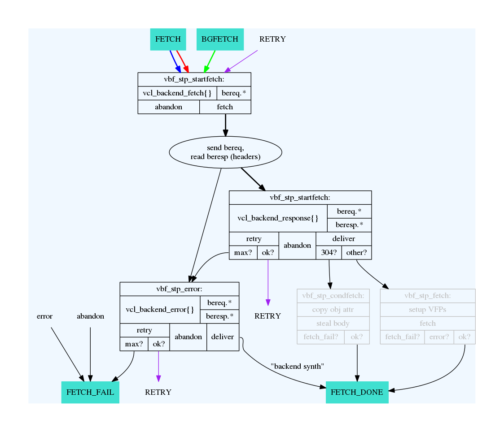

Appendix A: State machine graphs
================================

See chapter 1 for information on how to generate these for yourself. They
are included for your convenience.

cache_req_fsm.png
-----------------

.. image:: img/c1/cache_req_fsm.png

``cache_req_fsm`` details the client-specific part of the VCL state engine.
And can be used when writing VCL. You want to look for the blocks that
read ``vcl_`` to identify VCL functions. The lines tell you how a
return-statement in VCL will affect the VCL state engine at large, and
which return statements are available where. You can also see which objects
are available where.

cache_fetch.png
---------------

``cache_fetch`` has the same format as the ``cache_req_fsm.png``, but
from the perspective of a backend request.

cache_http1_fsm.png
-------------------

.. image:: img/c1/cache_http1_fsm.png

Of the three, this is the least practical flow chart, mainly included for
completeness. It does not document much related to VCL or practical Varnish
usage, but the internal state engine of an HTTP request in Varnish. It can
sometimes be helpful for debugging internal Varnish issues.
