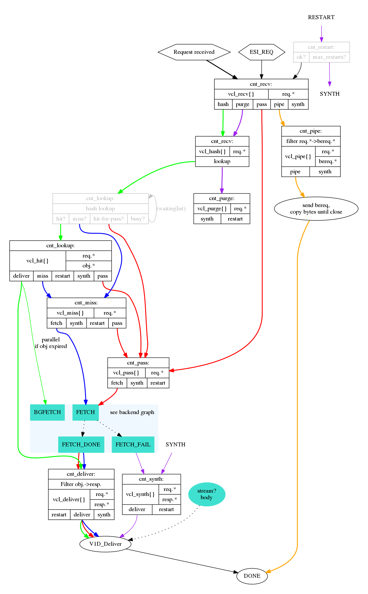

Introduction
============

This is the only chapter written in first person.

I've worked on Varnish since late 2008, first for Redpill Linpro,
then Varnish Software, then, after a brief pause, for Redpill Linpro again.
Over the years I've written code, written Varnish modules and blog posts,
tried to push the boundaries of what Varnish can do, debugged or analyzed
countless Varnish sites, probably held more training courses than anyone
else, written training material, and generally helped shape the Varnish
community.

Today I find myself in a position where the training material I once
maintained is no longer my responsibility. But I still love writing, and
there's an obvious need for documentation for Varnish.

I came up with a simple solution: I will write a book. Because I couldn't
imagine that I would ever finish it if I attempted writing a whole book in
one go, I decided I would publish one chapter at a time on my blog. This is
the first chapter of that book.

You will find the source on https://github.com/KristianLyng/varnishfoo.
While the format will be that of a book, I intend to keep it alive with
revisions.

I intend to cover as much Varnish-related content as possible, from
administration to web development and infrastructure. My hope is that one
day, this will be good enough that it will be worth printing as more
than just a leaflet.

I am writing this in my spare time, I retain full ownership of the
material. For now, the material is available under a Creative Commons
"CC-BY-SA-NC" license. This is a Creative Commons license that allows full
non-commercial usage to you as the reader, including copies and
modifications, as long as attribution is provided. The NC-part of that
license will be removed when I feel the material has matured enough and the
time is right. To clarify, the "non-commercial" clause is aimed at people
wanting to sell the book or use it in commercial training (or similar) - it
is not intended to prevent you from reading the material at work.

I hope you will enjoy this book, and I would appreciate any feedback you
could give, positive or negative.

Target audience and format
--------------------------

This book covers a large range of subjects related to Varnish. The first
few chapters are general enough to be of interest to all, while later
chapters specialize on certain aspects of Varnish usage.

Each chapter stands well on its own, but there are some cross-references.
The book focuses on best practices and good habits that will help you
beyond what just a few examples or explanations will do.

Each chapter provides both theory and practical examples. Each example
is tested with a recent Varnish Version where relevant, and is based on
experience from real-world Varnish installations.

What is Varnish
---------------

Varnish is a web server.

Unlike most web servers, Varnish does not read content from a hard drive,
or run programs that generates content from SQL databases. Varnish acquires
the content from other web servers. Usually it will keep a copy of that
content around in memory for a while to avoid fetching the same content
multiple times, but not necessarily.

There are numerous reasons you might want Varnish:

1. Your web server/application is a beastly nightmare where performance is
   measured in page views per hour - on a good day.
2. Your content needs to be available from multiple geographically diverse
   locations.
3. Your web site consists of numerous different little parts that you need
   to glue together in a sensible manner.
4. Your boss bought a service subscription and now has to justify the
   budget post.
5. You like Varnish.
6. ???

Varnish is designed around two simple concepts: Give you the means to fix
or work around technical challenges. And speed. Speed was largely handled
very early on, and Varnish is quite simply fast. This is achieved by being,
at the core, simple. The less you have to do for each request, the more
requests you can handle.

The name suggests what it's all about::

        From The Collaborative International Dictionary of English v.0.48 [gcide]:

          Varnish \Var"nish\, v. t. [imp. & p. p. {Varnished}; p. pr. &
             vb. n. {Varnishing}.] [Cf. F. vernir, vernisser. See
             {Varnish}, n.]
             [1913 Webster]
             1. To lay varnish on; to cover with a liquid which produces,
                when dry, a hard, glossy surface; as, to varnish a table;
                to varnish a painting.
                [1913 Webster]
          
             2. To cover or conceal with something that gives a fair
                appearance; to give a fair coloring to by words; to gloss
                over; to palliate; as, to varnish guilt. "Beauty doth
                varnish age." --Shak.
                [1913 Webster]

Varnish can be used to smooth over rough edges in your stack, to give a fair
appearance.

History
-------

.. _VG: http://www.vg.no

The Varnish project began in 2005. The issue to be solved was that of a
large Norwegian news site (or alternatively a tiny international site). The
first release came in 2006, and worked well for www.vg.no. In 2008, Varnish
2.0 came, which opened Varnish up to more sites, as long as they looked and
behaved similar to www.vg.no.  As time progressed and more people started
using Varnish, Varnish has been adapted to a large and varied set of use
cases.

From the beginning, the project was administered by Redpill Linpro, with
the majority of development being done by Poul-Henning Kamp through his own
company and his Varnish Moral License. In 2010, Varnish Software sprung out
from Redpill Linpro. Varnish Cache has always been a free software project,
and while Varnish Software has been custodians of the infrastructure and
large contributors of code and cash, the project is independent and has a
completely open development process.

Varnish Plus was born some time during 2011, all though it didn't go by
that name at the time. It was the result of somewhat conflicting interests.
Varnish Software had customer obligations that required features, and the
development power to implement them, but they did not necessarily align
with the goals and time frames of Varnish Cache. Varnish Plus became a
commercial test-bed for features that were not `yet` in Varnish Cache for
various reasons. As time passed, many of the features that begun life in
Varnish Plus have trickled into Varnish Cache proper in one way or an other
(streaming, surrogate keys, and more), and some have still to make it. Some
may never make it. This book focuses on Varnish Cache proper, but will
reference Varnish Plus where it makes sense.

With Varnish 3.0, released in 2011, Varnish modules suddenly became very
popular. These are modules that are not part of the Varnish Cache code
base, but are loaded at run-time to add features such as cryptographic hash
functions (vmod-digest) and memcached.

Varnish would not be where it is today without a large number of people and
businesses. Varnish Software have contributed and continues to contribute
numerous tools, vmods, and core features. Poul-Henning Kamp is still the
gatekeeper of Varnish Cache code, and does the majority of the
architectural work. Over the years, there have been too many companies and
individuals involved to list them all here.

Today, Varnish is used by CDNs and news papers, APIs and blogs.

More than just cache
--------------------

Varnish caches content, but can do much more. In 2008, it was used to
rewrite URLs, normalize HTTP headers and similar things. Today, it is used
to implement paywalls (whether you like them or not), API metering, load
balancing, CDNs, and more.

Varnish has a powerful configuration language, the Varnish Configuration
Language (VCL). VCL isn't parsed the traditional way a configuration file
is, but is translated to C code, compiled and linked into the running
Varnish. From the beginning, it was possible to bypass the entire
translation process and provide C code directly, which was never
recommended. Much of the experimental in-line C code from past Varnish
versions have found new life in Varnish modules since their introduction.

There is also a often overlooked Varnish agent that provides a HTTP REST
interface for managing Varnish. This can be used to extract metrics, review
or optionally change configuration, stop and start Varnish, and more. The
agent lives on https://github.com/varnish/vagent2, and is packaged for most
distributions today.

Using Varnish to gracefully handle operational issues is common.  Serving
cached content past its expiry time while a web server is down, or
switching to a different server, will give your users a better browsing
experience. And in a worst case scenario, at least the user can be
presented with a real error message instead of a refused or timed out
connection.

Edge Side Includes is a means to build a single HTTP object (like a HTML
page) from multiple smaller object, with different caching properties. This
lets content writers provide more fine-grained caching strategies without
having to be too smart about it.

Where to get help
-----------------

The official varnish documentation is available both as manual pages (run
``man -k varnish`` on a machine with a properly installed Varnish package),
and as online documentation found under http://varnish-cache.org/docs/. You
will also find a user-guide and a tutorial in the same on-line
documentation.

Varnish Software publishes their official training material, which is
called "The Varnish Book" (Not to be confused with THIS book about
Varnish). This is available freely through their site at
http://varnish-software.com, after registration.

An other less known source of information for Varnish is the flow
charts/``dot``-graphs used to document the VCL state engine. The only
official location for this is found in the source code of Varnish, under
``doc/graphviz/``. They can be generated, assuming you have
``graphviz`` installed::

        # git clone http://github.com/varnish/Varnish-Cache/
        Cloning into 'Varnish-Cache'...
        (...)
        # cd Varnish-Cache/
        # cd doc/graphviz/
        # for a in *dot; do dot -Tpng $a > $(echo $a | sed s/.dot/.png/); done
        # ls *png

Alternatively, replace ``-Tpng`` and ``.png``  with ``-Tsvg`` and ``.svg``
respectively to get vector graphics, or ``-Tpdf``/``.pdf`` for pdfs.

For convenience, the graphs from Varnish 4.1 are included. If you don't
quite grasp what these tell you yet, don't be too alarmed. These graphs are
provided early as they are useful to have around as reference material and
because there is no official location to find them pre-generated. A
brief explanation for each is included, mostly to help you in later
chapters.

cache_req_fsm.png
.................

``cache_req_fsm`` details the client-specific part of the VCL state engine.
And can be used when writing VCL. You want to look for the blocks that
read ``vcl_`` to identify VCL functions. The lines tell you how a
return-statement in VCL will affect the VCL state engine at large, and
which return statements are available where. You can also see which objects
are available where.

cache_fetch.png
...............

.. image:: img/cache_fetch.png

``cache_fetch`` has the same format as the ``cache_req_fsm.png``, but
from the perspective of a backend request.

cache_http1_fsm.png
...................

.. image:: img/cache_http1_fsm.png

Of the three, this is the least practical flow chart, mainly included for
completeness. It does not document much related to VCL or practical Varnish
usage, but the internal state engine of an HTTP request in Varnish. It can
sometimes be helpful for debugging internal Varnish issues.
