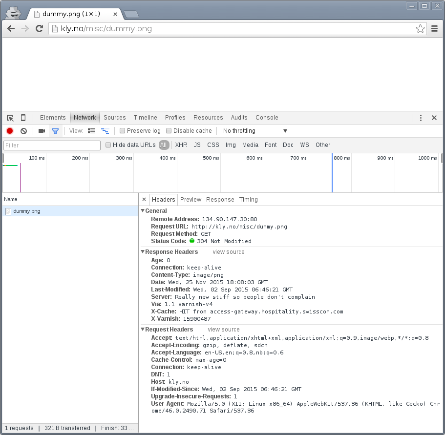

Working with HTTP caching
=========================

.. _RFC2616: https://www.ietf.org/rfc/rfc2616.txt

Before we dig into the inner workings of Varnish, it's important to
make sure we have the tools we need and some background information on
basic caching.

In this chapter, we will look at how HTTP caching works on multiple points
in the HTTP delivery chain, and how these mechanisms work together.

There are a multitude of tools to chose from when you are working with
Varnish. This chapter provides a few suggestions, but makes no claim on
whether one tool is better than the other. We will go through two different
type of client tools: The browser and a command line tool. This chapter
also sets up a simple web server for testing, and demonstrates several
aspects of how Varnish behaves.

The focus, however, is not the individual tools, but HTTP caching and how
we can debug it and affect it without modifying the proxy or browser.

After the tools are covered and demonstrated, we will go through how you
can control cache through the means of HTTP headers, both for browsers
and proxies like Varnish, using the mechanisms provided through
`RFC2616`_.

Tools: The browser
------------------

Your browser is a powerful tool, because it does a great deal of caching
and HTTP. Most browsers have a developer- or debug console, but we will
focus on Chrome and Firefox.

Both Firefox and Chrome will open the debug console if you hit ``<F12>``.
It's a good habit to test and experiment with more than one browser, and
luckily these consoles are very similar. A strong case in favor of Chrome
is `Incognito Mode`, activated through ``<Ctrl>+<Shit>+N``. This is an
advantage both because it removes old cookies and because most extensions
are disabled.

An argument for Firefox is that it's fairly easy to operate with
multiple profiles. One of these profiles could be used to run Firefox
through a SOCKS proxy for example to test a HTTP service that's not yet put
in production for example, or otherwise behind a firewall. You can achieve
this by running Firefox with ``--no-remote --ProfileManager`` (FIXME:
Windows?).

The importance of Incognito Mode can be easily demonstrated. The following
is a test with a typical Chrome session:

.. image:: img/chromium-dev-plugins.png

Notice the multiple extensions that are active, one of them is inserting a
bogus call to socialwidgets.css. The exact same test in Incognito Mode:

.. image:: img/chromium-dev-incognito.png

Now the extra reuest is gone.

You will also quickly learn that a refresh isn't always just a refresh.
In both Firefox and Chrome, a refresh triggered by ``<F5>`` or
``<Ctrl>+r`` will be "cache aware". What does that mean?

Look closer on the screenshots above, specially the return code. The return
code is a ``304 Not Modified``, not a ``200 OK``. This means our browser
actually had the image in cache already and issued what is known as a
`conditional GET request`. A closer inspection:

Our browser is sending ``Cache-Control: max-age=0`` and an
``If-Modified-Since``-header, and the web server correctly responds with
``304 Not Modified``.  We'll shortly look closer at those, but for now,
let's use a different type of refresh: ``<Shift>+<F5>`` in Chrome or
``<Shift>+<Ctrl>+r`` in Firefox:

.. image:: img/chromium-dev-304-2.png

Our cache-related headers have changed somewhat, and our browser is no
longer sending a ``If-Modified-Since`` header. The result is a ``200 OK``
with the actual content instead of an empty ``304 Not Modified``.

Tools: The command line tool
----------------------------

The browser does a lot more than issue HTTP requests, specially with
regards to cache. A good request synthesizer is a must to debug and
experiment with HTTP and HTTP caching without stumbling over the browser.
There are countless alternatives available.

Your requirement for a simple HTTP request synthesizer should be:

- Complete control over request headers and request method - even invalid
  input.
- Stateless behavior - no caching at all
- Show complete response headers.

Some suggestions for Windows users are ``curl`` in Powershell, Charles Web
Debugging Proxy, the "Test and Rest Client" in PhpStorm, an "Adanced RST
client" Chrome extension, or simply SSH'ing to a GNU/Linux VM and using one
of the many tools available there. The list goes on, and so it could for
Mac OS X and Linux too.

`HTTPie` is a small CLI tool which has the above properties. It's used
throughout this book because it is a good tool, but also because it's easy
to see what's going on without knowledge of the tool.

HTTPie is available on Linux, Mac OS X and Windows. On a Debian or Ubuntu
system HTTPie can be installed with ``apt-get install httpie``. For other
platforms, see http://httpie.org. Testing httpie is simple::

        $ http http://kly.no/misc/dummy.png
        HTTP/1.1 200 OK
        Accept-Ranges: bytes
        Age: 0
        Connection: keep-alive
        Content-Length: 178
        Content-Type: image/png
        Date: Wed, 25 Nov 2015 18:49:33 GMT
        Last-Modified: Wed, 02 Sep 2015 06:46:21 GMT
        Server: Really new stuff so people don't complain
        Via: 1.1 varnish-v4
        X-Cache: MISS from access-gateway.hospitality.swisscom.com
        X-Varnish: 15849590

        +-----------------------------------------+
        | NOTE: binary data not shown in terminal |
        +-----------------------------------------+

In many situations, the actual data is often not that interesting, while a
full set of request headers are very interesting. HTTPie can show us
exactly what we want::

        $ http -p Hh http://kly.no/misc/dummy.png
        GET /misc/dummy.png HTTP/1.1
        Accept: */*
        Accept-Encoding: gzip, deflate
        Connection: keep-alive
        Host: kly.no
        User-Agent: HTTPie/0.8.0

        HTTP/1.1 200 OK
        Accept-Ranges: bytes
        Age: 81
        Connection: keep-alive
        Content-Length: 178
        Content-Type: image/png
        Date: Wed, 25 Nov 2015 18:49:33 GMT
        Last-Modified: Wed, 02 Sep 2015 06:46:21 GMT
        Server: Really new stuff so people don't complain
        Via: 1.1 varnish-v4
        X-Cache: HIT from access-gateway.hospitality.swisscom.com
        X-Varnish: 15849590

The ``-p`` option to ``http`` can be used to control output. Specifically:

- ``-p H`` will print request headers.
- ``-p h`` will print response headers.
- ``-p B`` will print request body.
- ``-p b`` will print response body.

These can combined. In the above example ``-p H`` and ``-p h`` combine to
form ``-p Hh``. See ``http --help`` and ``man http`` for details. Be aware
that there has been some mismatch between actual command line arguments and
what the documentation claims in the past, this depends on the version of
HTTPie.

The example shows the original request headers and full response headers.

An other thing you'll want to do is use a fake ``Host``-header. If you are
setting up a Varnish server - or any other Web server - it's useful to test
it properly without pointing the real DNS name at the development server.
Here's an example of how to do that::

        $ http -p Hh http://kly.no/ "Host: example.com"
        GET / HTTP/1.1
        Accept: */*
        Accept-Encoding: gzip, deflate
        Connection: keep-alive
        Host:  example.com
        User-Agent: HTTPie/0.8.0

        HTTP/1.1 200 OK
        Accept-Ranges: bytes
        Age: 0
        Connection: keep-alive
        Content-Encoding: gzip
        Content-Type: text/html
        Date: Wed, 25 Nov 2015 18:58:10 GMT
        Last-Modified: Tue, 24 Nov 2015 20:51:14 GMT
        Server: Really new stuff so people don't complain
        Transfer-Encoding: chunked
        Via: 1.1 varnish-v4
        X-Cache: MISS from access-gateway.hospitality.swisscom.com
        X-Varnish: 15577233

We can also add some other headers too. Let's make it interesting::

        $ http -p Hh http://kly.no/ "If-Modified-Since: Tue, 24 Nov 2015 20:51:14 GMT"
        GET / HTTP/1.1
        Accept: */*
        Accept-Encoding: gzip, deflate
        Connection: keep-alive
        Host: kly.no
        If-Modified-Since:  Tue, 24 Nov 2015 20:51:14 GMT
        User-Agent: HTTPie/0.8.0

        HTTP/1.1 304 Not Modified
        Age: 5
        Connection: keep-alive
        Content-Encoding: gzip
        Content-Type: text/html
        Date: Wed, 25 Nov 2015 18:59:28 GMT
        Last-Modified: Tue, 24 Nov 2015 20:51:14 GMT
        Server: Really new stuff so people don't complain
        Via: 1.1 varnish-v4
        X-Cache: MISS from access-gateway.hospitality.swisscom.com
        X-Varnish: 15880392 15904200

We just simulated what our browser did, and verified that it really was the
``If-Modified-Since`` header that made the difference earlier. You can have
multiple headers by just listing them after each other::

        $ http -p Hh http://kly.no/ "Host: example.com" "User-Agent: foo" "X-demo: bar"
        GET / HTTP/1.1
        Accept: */*
        Accept-Encoding: gzip, deflate
        Connection: keep-alive
        Host:  example.com
        User-Agent:  foo
        X-demo:  bar

        HTTP/1.1 200 OK
        Accept-Ranges: bytes
        Age: 10
        Connection: keep-alive
        Content-Encoding: gzip
        Content-Length: 24681
        Content-Type: text/html
        Date: Wed, 25 Nov 2015 19:01:08 GMT
        Last-Modified: Tue, 24 Nov 2015 20:51:14 GMT
        Server: Really new stuff so people don't complain
        Via: 1.1 varnish-v4
        X-Cache: MISS from access-gateway.hospitality.swisscom.com
        X-Varnish: 15759349 15809060

Tools: A web server
-------------------

This one is a bit obvious, and regardless of what example is used in a
book, it's the wrong one. So we'll just pick one: Apache.

You can do the same with any half-decent web server, but what you want is a
web server where you can easily modify response headers to some degree. If
you are comfortable doing that with NodeJS or some other slightly more
modern tool than Apache, then go ahead. If you really don't care and just
want a test environment, then keep reading. To save some time, these
examples are oriented around Debian and/or Ubuntu-systems, but largely
apply to any modern GNU/Linux distribution (and other UNIX-like systems).

Note that commands that start with ``#`` are executed as root, while
commands starting with ``$`` can be run as a regular user. This means you
either have to login as root directly, through ``su -`` or ``sudo -i``, or
prefix the command with ``sudo`` if you've set up sudo on your system.

Our first step is getting it installed and configured::

        # apt-get install apache2
        (...)
        # a2enmod cgi
        # cd /etc/apache2
        # sed -i 's/80/8080/g' ports.conf sites-enabled/000-default.conf 
        # service apache2 restart

In short, what we just did is install Apache httpd, enable the CGI module,
change the listening port from port 80 to 8080, then restart the web
server. We changed the listening port to prepare for things to come.
You can verify that it works through two means::

        # netstat -nlpt
        Active Internet connections (only servers)
        Proto Recv-Q Send-Q Local Address           Foreign Address         State PID/Program name
        tcp6       0      0 :::8080                 :::*                    LISTEN 1101/apache2
        # http -p Hh http://localhost:8080/
        GET / HTTP/1.1
        Accept: */*
        Accept-Encoding: gzip, deflate
        Connection: keep-alive
        Host: localhost:8080
        User-Agent: HTTPie/0.8.0

        HTTP/1.1 200 OK
        Accept-Ranges: bytes
        Connection: Keep-Alive
        Content-Encoding: gzip
        Content-Length: 3078
        Content-Type: text/html
        Date: Wed, 25 Nov 2015 20:23:09 GMT
        ETag: "2b60-525632b42b90d-gzip"
        Keep-Alive: timeout=5, max=100
        Last-Modified: Wed, 25 Nov 2015 20:19:01 GMT
        Server: Apache/2.4.10 (Debian)
        Vary: Accept-Encoding

Now let's make a CGI script to test some custom-headers::

        # cd /usr/lib/cgi-bin
        # cat > foo.sh <<_EOF_
         #!/bin/bash
         echo "Content-type: text/plain"
         echo
         echo "Hello. Random number: ${RANDOM}"
         date
         _EOF_
        # chmod a+x foo.sh
        # ./foo.sh
        Content-type: text/plain

        Hello. Random number: 21126
        Wed Nov 25 20:26:59 UTC 2015

You may want to use an actual editor, like ``vim``, ``emacs`` or ``nano``
instead of using ``cat`` of course. To clarify, the exact content of
``foo.sh`` should be::

         #!/bin/bash
         echo "Content-type: text/plain"
         echo
         echo "Hello. Random number: ${RANDOM}"
         date

We then change permissions for it, making it executable by all users, then
verify that it does what it's supposed to. Next up, let's test if we can
run it through Apache::

        # http -p Hhb http://localhost:8080/cgi-bin/foo.sh
        GET /cgi-bin/foo.sh HTTP/1.1
        Accept: */*
        Accept-Encoding: gzip, deflate
        Connection: keep-alive
        Host: localhost:8080
        User-Agent: HTTPie/0.8.0

        HTTP/1.1 200 OK
        Connection: Keep-Alive
        Content-Length: 57
        Content-Type: text/plain
        Date: Wed, 25 Nov 2015 20:31:00 GMT
        Keep-Alive: timeout=5, max=100
        Server: Apache/2.4.10 (Debian)

        Hello. Random number: 21126
        Wed Nov 25 20:31:00 UTC 2015

If you've been able to reproduce the above example, you're ready to start
start testing and experimenting.

Tools: Varnish
--------------

We need an intermediary cache, and what better example than Varnish? We'll
refrain from configuring Varnish beyond the defaults for now, though.

For now, let's just install Varnish. This assumes you're using a Debian or
Ubuntu-system and that you have a web server listening on port 8080, as
Varnish uses a web server on port 8080 by default::

        # apt-get install varnish
        # service varnish start
        # http -p Hhb http://localhost:6081/cgi-bin/foo.sh
        GET /cgi-bin/foo.sh HTTP/1.1
        Accept: */*
        Accept-Encoding: gzip, deflate
        Connection: keep-alive
        Host: localhost:6081
        User-Agent: HTTPie/0.8.0

        HTTP/1.1 200 OK
        Accept-Ranges: bytes
        Age: 0
        Connection: keep-alive
        Content-Length: 57
        Content-Type: text/plain
        Date: Wed, 25 Nov 2015 20:38:09 GMT
        Server: Apache/2.4.10 (Debian)
        Via: 1.1 varnish-v4
        X-Varnish: 5

        Hello. Random number: 21126
        Wed Nov 25 20:38:09 UTC 2015

As you can see from the above example, a typical Varnish installation
listens to port 6081 by default, and uses ``127.0.0.1:8080`` as the backend
web server. If the above example doesn't work, you can change the listening
port of Varnish by altering the ``-a`` argument in ``/etc/default/varnish``
and issuing ``service varnish restart``, and the backend web server can be
changed in ``/etc/varnish/default.vcl``, then issue a restart with
``service varnish restart``. We'll cover both of these files in detail in
later chapters.

Conditional GET requests
------------------------

In the tool-examples earlier we saw a real example of a `conditional GET
request`. In many ways, they are quite simple mechanisms to allow a HTTP
client - typically a browser - to verify that they have the most up-to-date
version of the HTTP object. There are two different types of conditional
GET requests: ``If-Modified-Since`` and ``If-None-Match``.

If a server sends ``Last-Modified``-header, the client can issue a
``If-Modified-Since`` header on later requests for the same content,
indicating that the server only needs to transmit this content if it's been
updated.

Some times it isn't trivial to know the modification time, but you might be
able to uniquely identify the content anyway. For that matter, the content
might have been changed back to the original state. This is where the
response header ``Etag`` comes into the picture.

An ``Etag`` header can be used to provide an arbitrary ID to an HTTP
object, and the client can then re-use that in a ``If-None-Match`` request
header.

Let's test this out for ourself. Let's modify our dummy-backend, that we
created in ``/usr/lib/cgi-bin/foo.sh`` (or your equivalent). The goal is to
send a static ``Etag`` header. Here's a modified version::

        #!/bin/bash
        echo "Content-type: text/plain"
        echo "Etag: testofetagnumber1"
        echo
        echo "Hello. Random number: 21126"
        date

Let's see what happens when we talk directly to Apache::

        # http http://localhost:8080/cgi-bin/foo.sh
        HTTP/1.1 200 OK
        Connection: Keep-Alive
        Content-Length: 57
        Content-Type: text/plain
        Date: Wed, 25 Nov 2015 20:43:25 GMT
        Etag: testofetagnumber1
        Keep-Alive: timeout=5, max=100
        Server: Apache/2.4.10 (Debian)

        Hello. Random number: 21126
        Wed Nov 25 20:43:25 UTC 2015

        # http http://localhost:8080/cgi-bin/foo.sh
        HTTP/1.1 200 OK
        Connection: Keep-Alive
        Content-Length: 57
        Content-Type: text/plain
        Date: Wed, 25 Nov 2015 20:43:28 GMT
        Etag: testofetagnumber1
        Keep-Alive: timeout=5, max=100
        Server: Apache/2.4.10 (Debian)

        Hello. Random number: 21126
        Wed Nov 25 20:43:28 UTC 2015

Two successive requests yielded updated content, but with the same Etag.
Now let's see how Varnish handles this::

        # http http://localhost:6081/cgi-bin/foo.sh
        HTTP/1.1 200 OK
        Accept-Ranges: bytes
        Age: 0
        Connection: keep-alive
        Content-Length: 57
        Content-Type: text/plain
        Date: Wed, 25 Nov 2015 20:44:53 GMT
        Etag: testofetagnumber1
        Server: Apache/2.4.10 (Debian)
        Via: 1.1 varnish-v4
        X-Varnish: 32770

        Hello. Random number: 21126
        Wed Nov 25 20:44:53 UTC 2015

        # http http://localhost:6081/cgi-bin/foo.sh
        HTTP/1.1 200 OK
        Accept-Ranges: bytes
        Age: 2
        Connection: keep-alive
        Content-Length: 57
        Content-Type: text/plain
        Date: Wed, 25 Nov 2015 20:44:53 GMT
        Etag: testofetagnumber1
        Server: Apache/2.4.10 (Debian)
        Via: 1.1 varnish-v4
        X-Varnish: 32773 32771

        Hello. Random number: 21126
        Wed Nov 25 20:44:53 UTC 2015

It's pretty easy to see the difference in the output. However, there are
two things happening here of interest. First, ``Etag`` doesn't matter for
this test because we never send ``If-None-Match``! So our ``http``-command
gets a ``200 OK``, not the ``304 Not Modified`` that we were looking for.
Let's try that again::

        # http http://localhost:6081/cgi-bin/foo.sh "If-None-Match:
        testofetagnumber1"
        HTTP/1.1 304 Not Modified
        Age: 0
        Connection: keep-alive
        Content-Type: text/plain
        Date: Wed, 25 Nov 2015 20:48:52 GMT
        Etag: testofetagnumber1
        Server: Apache/2.4.10 (Debian)
        Via: 1.1 varnish-v4
        X-Varnish: 8

Now we see ``Etag`` and ``If-None-Match`` at work. Also note the absence of
a body: we just saved bandwidth.

Let's try to change our ``If-None-Match`` header a bit::

        # http http://localhost:6081/cgi-bin/foo.sh "If-None-Match: testofetagnumber2"
        HTTP/1.1 200 OK
        Accept-Ranges: bytes
        Age: 0
        Connection: keep-alive
        Content-Length: 57
        Content-Type: text/plain
        Date: Wed, 25 Nov 2015 20:51:10 GMT
        Etag: testofetagnumber1
        Server: Apache/2.4.10 (Debian)
        Via: 1.1 varnish-v4
        X-Varnish: 11

        Hello. Random number: 21126
        Wed Nov 25 20:51:10 UTC 2015

Content!

The observant reader will have noticed several other things that Varnish
did. Suddenly there's an ``Age`` header, for instance. That's next on our
agenda.

.. Warning::

        Hopefully our demo also illustrates that supplying static ``Etag``
        headers or bogus ``Last-Modified`` headers can have unexpected side
        effects. In our example, ``foo.sh`` clearly provides new content
        every time. Talking directly to the web server resulted in the
        desired behavior of the client getting the updated content, but
        only because the web server ignored the conditional part of the
        request.

        The danger is not Varnish - which we can control -  but proxy
        servers outside of our control sitting between the client and the
        web server. Even if your web server ignores ``If-None-Match`` and
        ``If-Modified-Since`` headers, there's no guarantee that other
        proxies do! Make sure you only provide ``Etag`` and
        ``Last-Modified``-headers that are correct, or don't provide them
        at all.

Cache control and age
---------------------

FIXME: Write this :p
