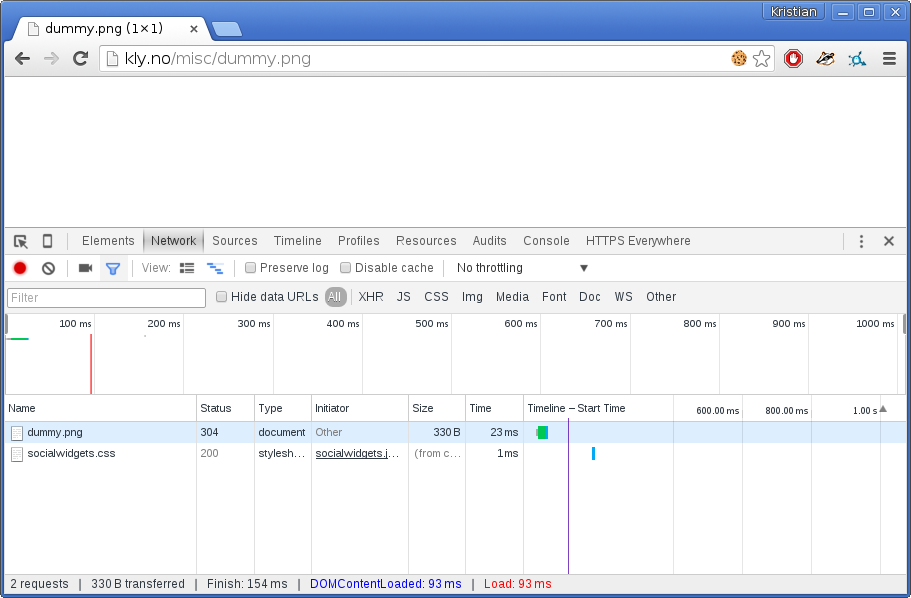
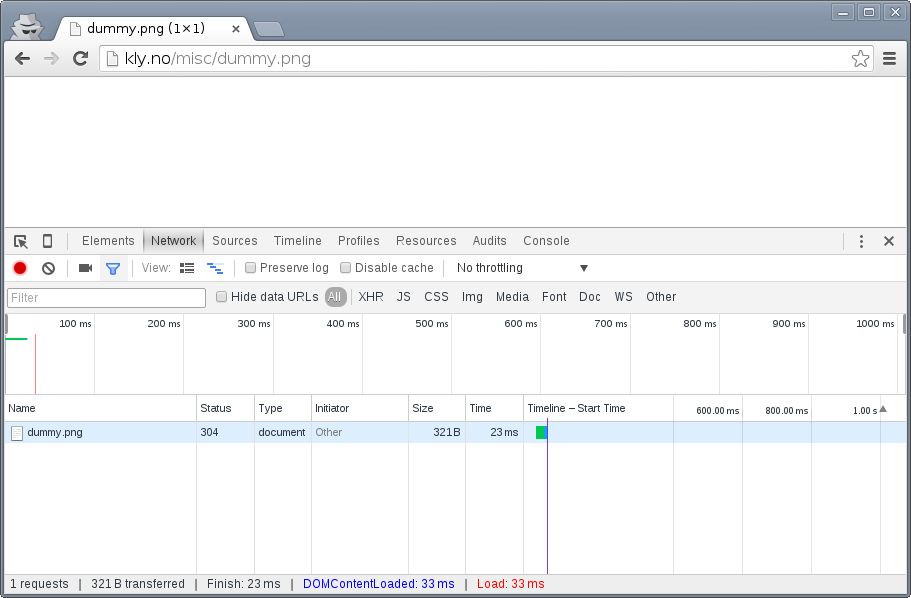
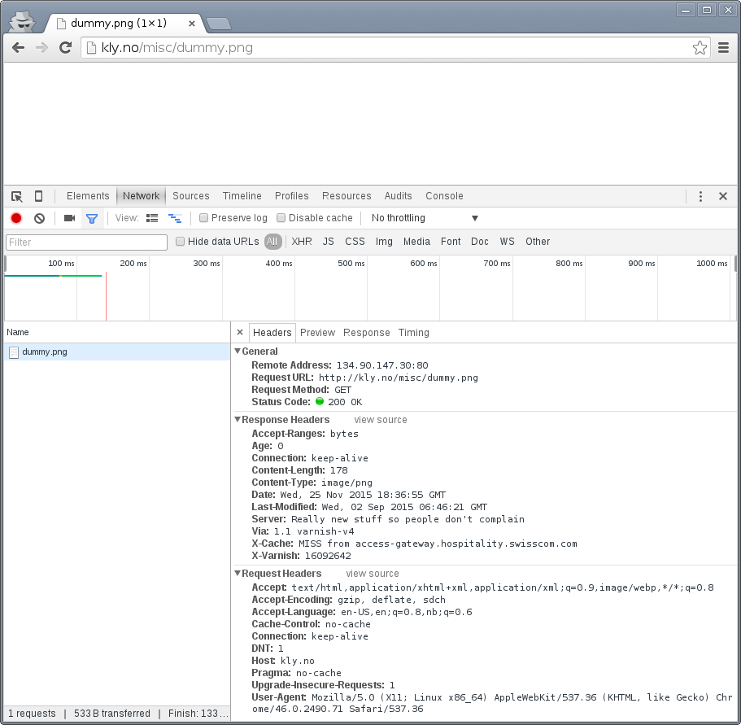
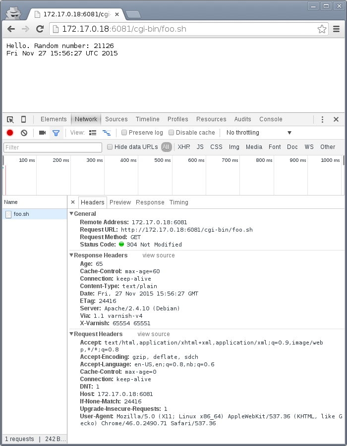

Working with HTTP caching
=========================

.. _RFC2616: https://www.ietf.org/rfc/rfc2616.txt
.. _RFC5861: https://www.ietf.org/rfc/rfc5861.txt

Before you dig into the inner workings of Varnish, it's important to
make sure you have the tools you need and some background information on
basic caching.

This chapter looks at how HTTP caching works on multiple points in the
delivery chain, and how these mechanisms work together. Not every aspect of
HTTP caching is covered, but those relevant to Varnish are covered in
detail. Including several browser-related concerns.

There are a multitude of tools to chose from when you are working with
Varnish. This chapter provides a few suggestions and a quick guide to each
tool, but makes no claim on whether one tool is better than the other. The
goal is to establish what sort of tasks your chosen tool needs to be able
to accomplish.

Only the absolute minimum of actual Varnish configuration is covered - yet
several mechanisms to control Varnish through backend responses are
provided. Most of these mechanisms are well defined in the HTTP 1.1
standard, as defined in `RFC2616`_.

Tools: The browser
------------------

A browser is an important tool. Most of todays web traffic is,
unsurprisingly, through a web browser. Therefor, it is important to be able
to dig deeper into how they work with regards to cache. Most browsers have
a developer- or debug console, but we will focus on Chrome.

Both Firefox and Chrome will open the debug console if you hit ``<F12>``.
It's a good habit to test and experiment with more than one browser, and
luckily these consoles are very similar. A strong case in favor of Chrome
is `Incognito Mode`, activated through ``<Ctrl>+<Shift>+N``. This is an
advantage both because it removes old cookies and because most extensions
are disabled. Most examples use Chrome to keep things consistent and
simple, but could just as well have been performed on Firefox.

The importance of Incognito Mode can be easily demonstrated. The following
is a test with a typical Chrome session:

Notice the multiple extensions that are active, one of them is inserting a
bogus call to ``socialwidgets.css``. The exact same test in Incognito Mode:

The extra request is gone. Regardless of browser choice, your test
environment should be devoid of most extensions and let you easily get rid
of all cookies.

You will also quickly learn that a refresh isn't always just a refresh.
In both Firefox and Chrome, a refresh triggered by ``<F5>`` or
``<Ctrl>+r`` will be "cache aware". What does that mean?

Look closer on the screenshots above, specially the return code. The return
code is a ``304 Not Modified``, not a ``200 OK``. The browser had the image
in cache already and issued a `conditional GET request`. A closer
inspection:

.. image:: img/c2/chromium-dev-304-1.png

The browser sends ``Cache-Control: max-age=0`` and an
``If-Modified-Since``-header. The web server correctly responds with
``304 Not Modified``. We'll look closer at those, but for now,
let's use a different type of refresh: ``<Shift>+<F5>`` in Chrome or
``<Shift>+<Ctrl>+r`` in Firefox:

The cache-related headers have changed somewhat, and the browser is no
longer sending a ``If-Modified-Since`` header. The result is a ``200 OK``
with response body instead of an empty ``304 Not Modified``.

These details are both the reason you need to test with a browser - because
this is how they operate - and why a simpler tool is needed in addition to
the browser.

Tools: The command line tool
----------------------------

The browser does a lot more than issue HTTP requests, specially with
regards to cache. A good request synthesizer is a must to debug and
experiment with HTTP and HTTP caching without stumbling over the browser.
There are countless alternatives available.

Your requirement for a simple HTTP request synthesizer should be:

- Complete control over request headers and request method - even invalid
  input.
- Stateless behavior - no caching at all
- Show complete response headers.

Some suggestions for Windows users are ``curl`` in Powershell, Charles Web
Debugging Proxy, the "Test and Rest Client" in PhpStorm, an "Adanced RST
client" Chrome extension, or simply SSH'ing to a GNU/Linux VM and using one
of the many tools available there. The list goes on, and so it could for
Mac OS X and Linux too.

`HTTPie` is a small CLI tool which has the above properties. It's used
throughout this book because it is a good tool, but also because it's easy
to see what's going on without knowledge of the tool.

HTTPie is available on Linux, Mac OS X and Windows. On a Debian or Ubuntu
system HTTPie can be installed with ``apt-get install httpie``. For other
platforms, see http://httpie.org. Testing httpie is simple::

        $ http http://kly.no/misc/dummy.png
        HTTP/1.1 200 OK
        Accept-Ranges: bytes
        Age: 0
        Connection: keep-alive
        Content-Length: 178
        Content-Type: image/png
        Date: Wed, 25 Nov 2015 18:49:33 GMT
        Last-Modified: Wed, 02 Sep 2015 06:46:21 GMT
        Server: Really new stuff so people don't complain
        Via: 1.1 varnish-v4
        X-Cache: MISS from access-gateway.hospitality.swisscom.com
        X-Varnish: 15849590

        +-----------------------------------------+
        | NOTE: binary data not shown in terminal |
        +-----------------------------------------+

In many situations, the actual data is often not that interesting, while a
full set of request headers are very interesting. HTTPie can show you
exactly what you want::

        $ http -p Hh http://kly.no/misc/dummy.png
        GET /misc/dummy.png HTTP/1.1
        Accept: */*
        Accept-Encoding: gzip, deflate
        Connection: keep-alive
        Host: kly.no
        User-Agent: HTTPie/0.8.0

        HTTP/1.1 200 OK
        Accept-Ranges: bytes
        Age: 81
        Connection: keep-alive
        Content-Length: 178
        Content-Type: image/png
        Date: Wed, 25 Nov 2015 18:49:33 GMT
        Last-Modified: Wed, 02 Sep 2015 06:46:21 GMT
        Server: Really new stuff so people don't complain
        Via: 1.1 varnish-v4
        X-Cache: HIT from access-gateway.hospitality.swisscom.com
        X-Varnish: 15849590

The ``-p`` option to ``http`` can be used to control output. Specifically:

- ``-p H`` will print request headers.
- ``-p h`` will print response headers.
- ``-p B`` will print request body.
- ``-p b`` will print response body.

These can combined. In the above example ``-p H`` and ``-p h`` combine to
form ``-p Hh``. See ``http --help`` and ``man http`` for details. Be aware
that there has been some mismatch between actual command line arguments and
what the documentation claims in the past, this depends on the version of
HTTPie.

The example shows the original request headers and full response headers.

Faking a ``Host``-header is frequently necessary to avoid changing DNS just
to test a Varnish setup. A decent request synthesizer like HTTPie does
this::

        $ http -p Hh http://kly.no/ "Host: example.com"
        GET / HTTP/1.1
        Accept: */*
        Accept-Encoding: gzip, deflate
        Connection: keep-alive
        Host:  example.com
        User-Agent: HTTPie/0.8.0

        HTTP/1.1 200 OK
        Accept-Ranges: bytes
        Age: 0
        Connection: keep-alive
        Content-Encoding: gzip
        Content-Type: text/html
        Date: Wed, 25 Nov 2015 18:58:10 GMT
        Last-Modified: Tue, 24 Nov 2015 20:51:14 GMT
        Server: Really new stuff so people don't complain
        Transfer-Encoding: chunked
        Via: 1.1 varnish-v4
        X-Cache: MISS from access-gateway.hospitality.swisscom.com
        X-Varnish: 15577233

Adding other headers is done the same way::

        $ http -p Hh http://kly.no/ "If-Modified-Since: Tue, 24 Nov 2015 20:51:14 GMT"
        GET / HTTP/1.1
        Accept: */*
        Accept-Encoding: gzip, deflate
        Connection: keep-alive
        Host: kly.no
        If-Modified-Since:  Tue, 24 Nov 2015 20:51:14 GMT
        User-Agent: HTTPie/0.8.0

        HTTP/1.1 304 Not Modified
        Age: 5
        Connection: keep-alive
        Content-Encoding: gzip
        Content-Type: text/html
        Date: Wed, 25 Nov 2015 18:59:28 GMT
        Last-Modified: Tue, 24 Nov 2015 20:51:14 GMT
        Server: Really new stuff so people don't complain
        Via: 1.1 varnish-v4
        X-Cache: MISS from access-gateway.hospitality.swisscom.com
        X-Varnish: 15880392 15904200

We just simulated what our browser did, and verified that it really was the
``If-Modified-Since`` header that made the difference earlier. To have
multiple headers, just list them one after an other::

        $ http -p Hh http://kly.no/ "Host: example.com" "User-Agent: foo" "X-demo: bar"
        GET / HTTP/1.1
        Accept: */*
        Accept-Encoding: gzip, deflate
        Connection: keep-alive
        Host:  example.com
        User-Agent:  foo
        X-demo:  bar

        HTTP/1.1 200 OK
        Accept-Ranges: bytes
        Age: 10
        Connection: keep-alive
        Content-Encoding: gzip
        Content-Length: 24681
        Content-Type: text/html
        Date: Wed, 25 Nov 2015 19:01:08 GMT
        Last-Modified: Tue, 24 Nov 2015 20:51:14 GMT
        Server: Really new stuff so people don't complain
        Via: 1.1 varnish-v4
        X-Cache: MISS from access-gateway.hospitality.swisscom.com
        X-Varnish: 15759349 15809060

Tools: A web server
-------------------

Regardless of what web server is picked as an example in this book, it's
the wrong one. So the first on an alphabetical list was chosen: Apache.

Any decent web server will do what you need. What you want is a web server
where you can easily modify response headers. If you are comfortable doing
that with NodeJS or some other slightly more modern tool than Apache, then
go ahead. If you really don't care and just want a test environment, then
keep reading. To save some time, these examples are oriented around Debian
and/or Ubuntu-systems, but largely apply to any modern GNU/Linux
distribution (and other UNIX-like systems).

Note that commands that start with ``#`` are executed as root, while
commands starting with ``$`` can be run as a regular user. This means you
either have to login as root directly, through ``su -`` or ``sudo -i``, or
prefix the command with ``sudo`` if you've set up sudo on your system.

The first step is getting it installed and configured::

        # apt-get install apache2
        (...)
        # a2enmod cgi
        # cd /etc/apache2
        # sed -i 's/80/8080/g' ports.conf sites-enabled/000-default.conf 
        # service apache2 restart

This installs Apache httpd, enables the CGI module, changes the listening
port from port 80 to 8080, then restarts the web server. The listening port
is changed because eventually Varnish will take up residence on port 80.

You can verify that it works through two means::

        # netstat -nlpt
        Active Internet connections (only servers)
        Proto Recv-Q Send-Q Local Address           Foreign Address         State PID/Program name
        tcp6       0      0 :::8080                 :::*                    LISTEN 1101/apache2
        # http -p Hh http://localhost:8080/
        GET / HTTP/1.1
        Accept: */*
        Accept-Encoding: gzip, deflate
        Connection: keep-alive
        Host: localhost:8080
        User-Agent: HTTPie/0.8.0

        HTTP/1.1 200 OK
        Accept-Ranges: bytes
        Connection: Keep-Alive
        Content-Encoding: gzip
        Content-Length: 3078
        Content-Type: text/html
        Date: Wed, 25 Nov 2015 20:23:09 GMT
        ETag: "2b60-525632b42b90d-gzip"
        Keep-Alive: timeout=5, max=100
        Last-Modified: Wed, 25 Nov 2015 20:19:01 GMT
        Server: Apache/2.4.10 (Debian)
        Vary: Accept-Encoding

``netstat`` reveals that ``apache2`` is listening on port 8080. The second
command issues an actual request. Both are useful to ensure the correct
service is answering.

To provide a platform for experimenting with response header, it's time to
drop in a CGI script::

        # cd /usr/lib/cgi-bin
        # cat > foo.sh <<_EOF_
         #!/bin/bash
         echo "Content-type: text/plain"
         echo
         echo "Hello. Random number: ${RANDOM}"
         date
         _EOF_
        # chmod a+x foo.sh
        # ./foo.sh
        Content-type: text/plain

        Hello. Random number: 12111
        Wed Nov 25 20:26:59 UTC 2015

You may want to use an editor, like ``nano``, ``vim`` or ``emacs`` instead
of using ``cat``. To clarify, the exact content of ``foo.sh`` is::

         #!/bin/bash
         echo "Content-type: text/plain"
         echo
         echo "Hello. Random number: ${RANDOM}"
         date

We then change permissions for ``foo.sh``, making it executable by all
users, then verify that it does what it's supposed to. If everything is set
up correctly, scripts under ``/usr/lib/cgi-bin`` are accessible through
``http://localhost:8080/cgi-bin/``::

        # http -p Hhb http://localhost:8080/cgi-bin/foo.sh
        GET /cgi-bin/foo.sh HTTP/1.1
        Accept: */*
        Accept-Encoding: gzip, deflate
        Connection: keep-alive
        Host: localhost:8080
        User-Agent: HTTPie/0.8.0

        HTTP/1.1 200 OK
        Connection: Keep-Alive
        Content-Length: 57
        Content-Type: text/plain
        Date: Wed, 25 Nov 2015 20:31:00 GMT
        Keep-Alive: timeout=5, max=100
        Server: Apache/2.4.10 (Debian)

        Hello. Random number: 12126
        Wed Nov 25 20:31:00 UTC 2015

If you've been able to reproduce the above example, you're ready to start
start testing and experimenting.

Tools: Varnish
--------------

We need an intermediary cache, and what better example than Varnish? We'll
refrain from configuring Varnish beyond the defaults for now, though.

For now, let's just install Varnish. This assumes you're using a Debian or
Ubuntu-system and that you have a web server listening on port 8080, as
Varnish uses a web server on port 8080 by default::

        # apt-get install varnish
        # service varnish start
        # http -p Hhb http://localhost:6081/cgi-bin/foo.sh
        GET /cgi-bin/foo.sh HTTP/1.1
        Accept: */*
        Accept-Encoding: gzip, deflate
        Connection: keep-alive
        Host: localhost:6081
        User-Agent: HTTPie/0.8.0

        HTTP/1.1 200 OK
        Accept-Ranges: bytes
        Age: 0
        Connection: keep-alive
        Content-Length: 57
        Content-Type: text/plain
        Date: Wed, 25 Nov 2015 20:38:09 GMT
        Server: Apache/2.4.10 (Debian)
        Via: 1.1 varnish-v4
        X-Varnish: 5

        Hello. Random number: 26
        Wed Nov 25 20:38:09 UTC 2015

As you can see from the above example, a typical Varnish installation
listens to port 6081 by default, and uses ``127.0.0.1:8080`` as the backend
web server. If the above example doesn't work, you can change the listening
port of Varnish by altering the ``-a`` argument in ``/etc/default/varnish``
and issuing ``service varnish restart``, and the backend web server can be
changed in ``/etc/varnish/default.vcl``, then issue a restart with
``service varnish restart``. We'll cover both of these files in detail in
later chapters.

Conditional GET requests
------------------------

In the tool-examples earlier we saw real examples of a `conditional GET
requests`. In many ways, they are quite simple mechanisms to allow a HTTP
client - typically a browser - to verify that they have the most up-to-date
version of the HTTP object. There are two different types of conditional
GET requests: ``If-Modified-Since`` and ``If-None-Match``.

If a server sends a ``Last-Modified``-header, the client can issue a
``If-Modified-Since`` header on later requests for the same content,
indicating that the server only needs to transmit the response body if it's
been updated.

Some times it isn't trivial to know the modification time, but you might be
able to uniquely identify the content anyway. For that matter, the content
might have been changed back to a previous state. This is where the
`entity tag`, or ``ETag`` response header is useful.

An ``Etag`` header can be used to provide an arbitrary ID to an HTTP
response, and the client can then re-use that in a ``If-None-Match``
request header.

Modifying ``/usr/lib/cgi-bin/foo.sh``, we can make it provide a static
``ETag`` header::

        #!/bin/bash
        echo "Content-type: text/plain"
        echo "Etag: testofetagnumber1"
        echo
        echo "Hello. Random number: ${RANDOM}"
        date

Let's see what happens when we talk directly to Apache::

        # http http://localhost:8080/cgi-bin/foo.sh
        HTTP/1.1 200 OK
        Connection: Keep-Alive
        Content-Length: 57
        Content-Type: text/plain
        Date: Wed, 25 Nov 2015 20:43:25 GMT
        Etag: testofetagnumber1
        Keep-Alive: timeout=5, max=100
        Server: Apache/2.4.10 (Debian)

        Hello. Random number: 51126
        Wed Nov 25 20:43:25 UTC 2015

        # http http://localhost:8080/cgi-bin/foo.sh
        HTTP/1.1 200 OK
        Connection: Keep-Alive
        Content-Length: 57
        Content-Type: text/plain
        Date: Wed, 25 Nov 2015 20:43:28 GMT
        Etag: testofetagnumber1
        Keep-Alive: timeout=5, max=100
        Server: Apache/2.4.10 (Debian)

        Hello. Random number: 12112
        Wed Nov 25 20:43:28 UTC 2015

Two successive requests yielded updated content, but with the same Etag.
Now let's see how Varnish handles this::

        # http http://localhost:6081/cgi-bin/foo.sh
        HTTP/1.1 200 OK
        Accept-Ranges: bytes
        Age: 0
        Connection: keep-alive
        Content-Length: 57
        Content-Type: text/plain
        Date: Wed, 25 Nov 2015 20:44:53 GMT
        Etag: testofetagnumber1
        Server: Apache/2.4.10 (Debian)
        Via: 1.1 varnish-v4
        X-Varnish: 32770

        Hello. Random number: 5213
        Wed Nov 25 20:44:53 UTC 2015

        # http http://localhost:6081/cgi-bin/foo.sh
        HTTP/1.1 200 OK
        Accept-Ranges: bytes
        Age: 2
        Connection: keep-alive
        Content-Length: 57
        Content-Type: text/plain
        Date: Wed, 25 Nov 2015 20:44:53 GMT
        Etag: testofetagnumber1
        Server: Apache/2.4.10 (Debian)
        Via: 1.1 varnish-v4
        X-Varnish: 32773 32771

        Hello. Random number: 5213
        Wed Nov 25 20:44:53 UTC 2015

It's pretty easy to see the difference in the output. However, there are
two things happening here of interest. First, ``Etag`` doesn't matter for
this test because we never send ``If-None-Match``! So our ``http``-command
gets a ``200 OK``, not the ``304 Not Modified`` that we were looking for.
Let's try that again::

        # http http://localhost:6081/cgi-bin/foo.sh "If-None-Match:
        testofetagnumber1"
        HTTP/1.1 304 Not Modified
        Age: 0
        Connection: keep-alive
        Content-Type: text/plain
        Date: Wed, 25 Nov 2015 20:48:52 GMT
        Etag: testofetagnumber1
        Server: Apache/2.4.10 (Debian)
        Via: 1.1 varnish-v4
        X-Varnish: 8

Now we see ``Etag`` and ``If-None-Match`` at work. Also note the absence of
a body: we just saved bandwidth.

Let's try to change our ``If-None-Match`` header a bit::

        # http http://localhost:6081/cgi-bin/foo.sh "If-None-Match: testofetagnumber2"
        HTTP/1.1 200 OK
        Accept-Ranges: bytes
        Age: 0
        Connection: keep-alive
        Content-Length: 57
        Content-Type: text/plain
        Date: Wed, 25 Nov 2015 20:51:10 GMT
        Etag: testofetagnumber1
        Server: Apache/2.4.10 (Debian)
        Via: 1.1 varnish-v4
        X-Varnish: 11

        Hello. Random number: 12942
        Wed Nov 25 20:51:10 UTC 2015

Content!

To summarize:

+-------------------+-----------------------+------------------------+
| Server            | Client                | Server                 |
+===================+=======================+========================+
| ``Last-Modified`` | ``If-Modified-Since`` | ``200 OK`` with full   |
|                   |                       | response body, or      |
+-------------------+-----------------------+ ``304 Not Modified``   |
| ``ETag``          | ``If-None-Match``     | with no response body. |
|                   |                       |                        |
+-------------------+-----------------------+------------------------+

.. Warning::

        The examples above also demonstrates that supplying static ``Etag``
        headers or bogus ``Last-Modified`` headers can have unexpected side
        effects. ``foo.sh`` provides new content every time. Talking
        directly to the web server resulted in the desired behavior of the
        client getting the updated content, but only because the web server
        ignored the conditional part of the request.

        The danger is not necessarily Varnish, but proxy servers outside of
        the control of the web site, sitting between the client and the web
        server. Even if a web server ignores ``If-None-Match`` and
        ``If-Modified-Since`` headers, there is no guarantee that other
        proxies do! Make sure to only provide ``Etag`` and
        ``Last-Modified``-headers that are correct, or don't provide them
        at all.

Cache control, age and grace
----------------------------

An HTTP object has an age. This is how long it is since the object was
fetched or validated from the origin source. In most cases, an object
starts acquiring age once it leaves a web server.

Age is measured in seconds. The HTTP response header ``Age`` is used to
forward the information regarding age to HTTP clients. You can specify
maximum age allowed both from a client and server. The most interesting
aspect of this is the HTTP header ``Cache-Control``. This is both a
response- and request-header, which means that both clients and servers can
emit this header.

The ``Age`` header has a single value: the age of the object measured in
seconds. The ``Cache-Control`` header, on the other hand, has a multitude
of variables and options. We'll begin with the simplest: ``max-age=``. This
is a variable that can be used both in a request-header and
response-header, but is most useful in the response header. Most web
servers and many intermediary caches (including Varnish), ignores a
``max-age`` field received in a HTTP request-header.

Setting ``max-age=0`` effectively disables caching, assuming the cache
obeys::

        # http http://localhost:6081/cgi-bin/foo.sh
        HTTP/1.1 200 OK
        Accept-Ranges: bytes
        Age: 0
        Cache-Control: max-age=0
        Connection: keep-alive
        Content-Length: 57
        Content-Type: text/plain
        Date: Fri, 27 Nov 2015 15:41:53 GMT
        Server: Apache/2.4.10 (Debian)
        Via: 1.1 varnish-v4
        X-Varnish: 32776

        Hello. Random number: 19972
        Fri Nov 27 15:41:53 UTC 2015

        # http http://localhost:6081/cgi-bin/foo.sh
        HTTP/1.1 200 OK
        Accept-Ranges: bytes
        Age: 0
        Cache-Control: max-age=0
        Connection: keep-alive
        Content-Length: 57
        Content-Type: text/plain
        Date: Fri, 27 Nov 2015 15:41:57 GMT
        Server: Apache/2.4.10 (Debian)
        Via: 1.1 varnish-v4
        X-Varnish: 32779

        Hello. Random number: 92124
        Fri Nov 27 15:41:57 UTC 2015

This example issues two requests against a modified
``http://localhost:6081/cgi-bin/foo.sh``. The modified version has set
``max-age=0`` to tell Varnish - and browsers - not to cache the content at
all. A similar example can be used for ``max-age=10``::

        # http http://localhost:6081/cgi-bin/foo.sh
        HTTP/1.1 200 OK
        Accept-Ranges: bytes
        Age: 0
        Cache-Control: max-age=10
        Connection: keep-alive
        Content-Length: 57
        Content-Type: text/plain
        Date: Fri, 27 Nov 2015 15:44:32 GMT
        Server: Apache/2.4.10 (Debian)
        Via: 1.1 varnish-v4
        X-Varnish: 14

        Hello. Random number: 19982
        Fri Nov 27 15:44:32 UTC 2015

        # http http://localhost:6081/cgi-bin/foo.sh
        HTTP/1.1 200 OK
        Accept-Ranges: bytes
        Age: 8
        Cache-Control: max-age=10
        Connection: keep-alive
        Content-Length: 57
        Content-Type: text/plain
        Date: Fri, 27 Nov 2015 15:44:32 GMT
        Server: Apache/2.4.10 (Debian)
        Via: 1.1 varnish-v4
        X-Varnish: 32782 15

        Hello. Random number: 19982
        Fri Nov 27 15:44:32 UTC 2015

        # http http://localhost:6081/cgi-bin/foo.sh
        HTTP/1.1 200 OK
        Accept-Ranges: bytes
        Age: 12
        Cache-Control: max-age=10
        Connection: keep-alive
        Content-Length: 57
        Content-Type: text/plain
        Date: Fri, 27 Nov 2015 15:44:32 GMT
        Server: Apache/2.4.10 (Debian)
        Via: 1.1 varnish-v4
        X-Varnish: 19 15

        Hello. Random number: 19982
        Fri Nov 27 15:44:32 UTC 2015

        # http http://localhost:6081/cgi-bin/foo.sh
        HTTP/1.1 200 OK
        Accept-Ranges: bytes
        Age: 2
        Cache-Control: max-age=10
        Connection: keep-alive
        Content-Length: 57
        Content-Type: text/plain
        Date: Fri, 27 Nov 2015 15:44:44 GMT
        Server: Apache/2.4.10 (Debian)
        Via: 1.1 varnish-v4
        X-Varnish: 65538 20

        Hello. Random number: 9126
        Fri Nov 27 15:44:44 UTC 2015

This example demonstrates several things:

- Varnish emits an ``Age`` header, telling you how old the object is.
- Varnish now caches.
- Varnish delivers a 12-second old object, despite ``max-age=10``!
- Varnish then deliver a 2 second old object? Despite no other request
  in-between.

What this example is showing, is Varnish's default grace mode. The simple
explanation is that Varnish keeps an object a little longer (10 seconds by
default) than the regular cache duration. If the object is requested during
this period, the cached variant of the object is sent to the client, while
Varnish issues a request to the backend server in parallel. This is also
called `stale while revalidate`. This happens even with zero configuration
for Varnish, and is covered detailed in later chapters. For now, it's good
to just get used to issuing an extra request to Varnish after the expiry
time to see the update take place.

Let's do an other example of this, using a browser, and 60 seconds of max
age and an ETag header set to something random so our browser can do
conditional GET requests:

.. image:: img/c2/age-1.png

On the first request we get a 27 second old object.

The second request is a conditional GET request because we had it in cache.
Note that our browser has already exceeded the max-age, but still made a
conditional GET request. A cache (browser or otherwise) may keep an object
longer than the suggested ``max-age``, as long as it verifies the content
before using it. The result is the same object, now with an age of 65
seconds.

.. image:: img/c2/age-3.png

The third request takes place just 18 seconds later. This is not a
conditional GET request, most likely because our browser correctly saw that
the ``Age`` of the previous object was 65, while ``max-age=60`` instructed
the browser to only keep the object until it reached an age of 60 - a time
which had already past. Our browser thus did not keep the object at all
this time.

Similarly, we can modify ``foo.sh`` to emit ``max-age=3600`` and ``Age:
3590``, pretending to be a cache. Speaking directly to Apache::

        # http http://localhost:8080/cgi-bin/foo.sh
        HTTP/1.1 200 OK
        Age: 3590
        Cache-Control: max-age=3600
        Connection: Keep-Alive
        Content-Length: 57
        Content-Type: text/plain
        Date: Fri, 27 Nov 2015 16:07:36 GMT
        ETag: 11235
        Keep-Alive: timeout=5, max=100
        Server: Apache/2.4.10 (Debian)

        Hello. Random number: 54251
        Fri Nov 27 16:07:36 UTC 2015

        # http http://localhost:8080/cgi-bin/foo.sh
        HTTP/1.1 200 OK
        Age: 3590
        Cache-Control: max-age=3600
        Connection: Keep-Alive
        Content-Length: 57
        Content-Type: text/plain
        Date: Fri, 27 Nov 2015 16:07:54 GMT
        ETag: 12583
        Keep-Alive: timeout=5, max=100
        Server: Apache/2.4.10 (Debian)

        Hello. Random number: 68323
        Fri Nov 27 16:07:54 UTC 2015

Nothing too exciting, but the requests returns what we should have learned
to expect by now.

Let's try three requests through Varnish::

        # http http://localhost:6081/cgi-bin/foo.sh
        HTTP/1.1 200 OK
        Accept-Ranges: bytes
        Age: 3590
        Cache-Control: max-age=3600
        Connection: keep-alive
        Content-Length: 57
        Content-Type: text/plain
        Date: Fri, 27 Nov 2015 16:08:50 GMT
        ETag: 9315
        Server: Apache/2.4.10 (Debian)
        Via: 1.1 varnish-v4
        X-Varnish: 65559

        Hello. Random number: 22609
        Fri Nov 27 16:08:50 UTC 2015

The first request is almost identical to the one we issued to Apache,
except a few added headers.

15 seconds later, we issue the same command again::

        # http http://localhost:6081/cgi-bin/foo.sh
        HTTP/1.1 200 OK
        Accept-Ranges: bytes
        Age: 3605
        Cache-Control: max-age=3600
        Connection: keep-alive
        Content-Length: 57
        Content-Type: text/plain
        Date: Fri, 27 Nov 2015 16:08:50 GMT
        ETag: 9315
        Server: Apache/2.4.10 (Debian)
        Via: 1.1 varnish-v4
        X-Varnish: 32803 65560

        Hello. Random number: 22609
        Fri Nov 27 16:08:50 UTC 2015

Varnish replies with a version from grace, and has issued an update to
Apache in the background. Note that the ``Age`` header is now increased,
and is clearly beyond the age limit of 3600.

4 seconds later, the third request::

        # http http://localhost:6081/cgi-bin/foo.sh
        HTTP/1.1 200 OK
        Accept-Ranges: bytes
        Age: 3594
        Cache-Control: max-age=3600
        Connection: keep-alive
        Content-Length: 57
        Content-Type: text/plain
        Date: Fri, 27 Nov 2015 16:09:05 GMT
        ETag: 24072
        Server: Apache/2.4.10 (Debian)
        Via: 1.1 varnish-v4
        X-Varnish: 65564 32804

        Hello. Random number: 76434
        Fri Nov 27 16:09:05 UTC 2015

Updated content!

The lessons to pick up from this is:

- ``Age`` is not just an informative header. It is used by intermediary
  caches and by browser caches.
- ``max-age`` is relative to ``Age`` and *not* to when the request was
  made.
- You can have multiple tiers of caches, and ``max-age=x`` will be correct
  for the end user if all intermediary caches correctly obey it and adds
  to ``Age``.

The ``Cache-Control`` header
----------------------------

The ``Cache-Control`` header has a multitude of possible values, and can be
supplied as both a request-header and response-header. Varnish ignores any
Cache-Control header received from a client - other caches might obey them.

It is defined in `RFC2616`_, 14.9. As Varnish ignores all ``Cache-Control``
headers in a client request, we will focus on the parts relevant to a HTTP
response, here's an excerpt from `RFC2616`_::

        Cache-Control   = "Cache-Control" ":" 1#cache-directive

        cache-directive = cache-request-directive
             | cache-response-directive

        (...)

         cache-response-directive =
               "public"                               ; Section 14.9.1
             | "private" [ "=" <"> 1#field-name <"> ] ; Section 14.9.1
             | "no-cache" [ "=" <"> 1#field-name <"> ]; Section 14.9.1
             | "no-store"                             ; Section 14.9.2
             | "no-transform"                         ; Section 14.9.5
             | "must-revalidate"                      ; Section 14.9.4
             | "proxy-revalidate"                     ; Section 14.9.4
             | "max-age" "=" delta-seconds            ; Section 14.9.3
             | "s-maxage" "=" delta-seconds           ; Section 14.9.3
             | cache-extension                        ; Section 14.9.6

        cache-extension = token [ "=" ( token | quoted-string ) ]

Among the above directives, Varnish only obeys ``s-maxage`` and ``max-age``
by default. It's worth looking closer specially at ``must-revalidate``.
This allows a client to cache the content, but requires it to send a
conditional GET request before actually using the content.

``s-maxage`` is of special interest to Varnish users. It instructs
intermediate caches, but not clients (e.g.: browsers). Varnish will pick
the value of ``s-maxage`` over ``max-age``, which makes it possible for a
web server to emit a ``Cache-Control`` header that gives different
instructions to browsers and Varnish::

        # http http://localhost:6081/cgi-bin/foo.sh
        HTTP/1.1 200 OK
        Accept-Ranges: bytes
        Age: 0
        Cache-Control: s-maxage=3600,max-age=5
        Connection: keep-alive
        Content-Type: text/plain
        Date: Fri, 27 Nov 2015 23:21:47 GMT
        Server: Apache/2.4.10 (Debian)
        Transfer-Encoding: chunked
        Via: 1.1 varnish-v4
        X-Varnish: 2

        Hello. Random number: 7684
        Fri Nov 27 23:21:47 UTC 2015

        # http http://localhost:6081/cgi-bin/foo.sh
        HTTP/1.1 200 OK
        Accept-Ranges: bytes
        Age: 8
        Cache-Control: s-maxage=3600,max-age=5
        Connection: keep-alive
        Content-Length: 57
        Content-Type: text/plain
        Date: Fri, 27 Nov 2015 23:21:47 GMT
        Server: Apache/2.4.10 (Debian)
        Via: 1.1 varnish-v4
        X-Varnish: 5 3

        Hello. Random number: 7684
        Fri Nov 27 23:21:47 UTC 2015

        # http http://localhost:6081/cgi-bin/foo.sh
        HTTP/1.1 200 OK
        Accept-Ranges: bytes
        Age: 16
        Cache-Control: s-maxage=3600,max-age=5
        Connection: keep-alive
        Content-Length: 57
        Content-Type: text/plain
        Date: Fri, 27 Nov 2015 23:21:47 GMT
        Server: Apache/2.4.10 (Debian)
        Via: 1.1 varnish-v4
        X-Varnish: 7 3

        Hello. Random number: 7684
        Fri Nov 27 23:21:47 UTC 2015

The first request populates the cache, the second returns a cache hit after
8 seconds, while the third confirms that no background fetch has caused an
update by returning the same object a third time.

Two important things to note here:

- The ``Age`` header is accurately reported. This effectively disables
  client-side caching after ``Age`` has reached 5 seconds.
- There could be other intermediate caches that would also use
  ``s-maxage``.

The solution to both these issues is the same: Remove or reset the
``Age``-header and remove or reset the ``s-maxage``-part of the
``Cache-Control`` header. Varnish does not do this by default, but we will
do both in later chapters. For now, just know that these are challenges.

``stale-while-revalidate``
--------------------------

In addition to `RFC2616`_, there's also the more recent `RFC5861`_ which
defines two additional variables for ``Cache-Control``::

     stale-while-revalidate = "stale-while-revalidate" "=" delta-seconds

and::

     stale-if-error = "stale-if-error" "=" delta-seconds

These two variables map very well to Varnish's `grace` mechanics, which
existed a few years before `RFC5861`_ came about.

Varnish 4.1 implements ``stale-while-revalidate`` for the first time, but
not ``stale-if-error``. Varnish has a default ``stale-while-revalidate``
value of 10 seconds. Earlier examples ran into this: You could see
responses that were a few seconds older than max-age, while a request to
revalidate the response was happening in the background.

A demo of default grace, pay attention to the ``Age`` header::

        # http -p h http://localhost:6081/cgi-bin/foo.sh
        HTTP/1.1 200 OK
        Accept-Ranges: bytes
        Age: 0
        Cache-Control: max-age=5
        Connection: keep-alive
        Content-Length: 56
        Content-Type: text/plain
        Date: Sun, 29 Nov 2015 15:10:56 GMT
        Server: Apache/2.4.10 (Debian)
        Via: 1.1 varnish-v4
        X-Varnish: 2

        # http -p h http://localhost:6081/cgi-bin/foo.sh
        HTTP/1.1 200 OK
        Accept-Ranges: bytes
        Age: 4
        Cache-Control: max-age=5
        Connection: keep-alive
        Content-Length: 56
        Content-Type: text/plain
        Date: Sun, 29 Nov 2015 15:10:56 GMT
        Server: Apache/2.4.10 (Debian)
        Via: 1.1 varnish-v4
        X-Varnish: 5 3

        # http -p h http://localhost:6081/cgi-bin/foo.sh
        HTTP/1.1 200 OK
        Accept-Ranges: bytes
        Age: 8
        Cache-Control: max-age=5
        Connection: keep-alive
        Content-Length: 56
        Content-Type: text/plain
        Date: Sun, 29 Nov 2015 15:10:56 GMT
        Server: Apache/2.4.10 (Debian)
        Via: 1.1 varnish-v4
        X-Varnish: 32770 3

        # http -p h http://localhost:6081/cgi-bin/foo.sh
        HTTP/1.1 200 OK
        Accept-Ranges: bytes
        Age: 4
        Cache-Control: max-age=5
        Connection: keep-alive
        Content-Length: 56
        Content-Type: text/plain
        Date: Sun, 29 Nov 2015 15:11:03 GMT
        Server: Apache/2.4.10 (Debian)
        Via: 1.1 varnish-v4
        X-Varnish: 65538 32771

On the third request, Varnish is returning an object that is 8 seconds old,
despite the ``max-age=5`` second. When this request was received, Varnish
immediately fired off a request to the web server to revalidate the object,
but returned the result from cache. This is also demonstrated by the fourth
request, where ``Age`` is already 4. The fourth request gets the result
from the backend-request started when the third request was received. So:

1. Request: Nothing in cache. Varnish requests content from backend, waits,
   and responds with that result.
2. Request: Standard cache hit.
3. Request: Varnish sees that the object in cache is `stale`, initiates a
   request to a backend server, but does NOT wait for the response.
   Instead, the result from cache is returned.
4. Request: By now, the backend-request initiated from the third request is
   complete. This is thus a standard cache hit.

This behavior means that slow backends will not affect client requests if
content is cached.

If this behavior is unwanted, you can disable grace by setting
``stale-while-revalidate=0``::

        # http -p h http://localhost:6081/cgi-bin/foo.sh
        HTTP/1.1 200 OK
        Accept-Ranges: bytes
        Age: 0
        Cache-Control: max-age=5, stale-while-revalidate=0
        Connection: keep-alive
        Content-Length: 57
        Content-Type: text/plain
        Date: Thu, 03 Dec 2015 12:50:36 GMT
        Server: Apache/2.4.10 (Debian)
        Via: 1.1 varnish-v4
        X-Varnish: 12

        # http -p h http://localhost:6081/cgi-bin/foo.sh
        HTTP/1.1 200 OK
        Accept-Ranges: bytes
        Age: 3
        Cache-Control: max-age=5, stale-while-revalidate=0
        Connection: keep-alive
        Content-Length: 57
        Content-Type: text/plain
        Date: Thu, 03 Dec 2015 12:50:36 GMT
        Server: Apache/2.4.10 (Debian)
        Via: 1.1 varnish-v4
        X-Varnish: 32773 13

        # http -p h http://localhost:6081/cgi-bin/foo.sh
        HTTP/1.1 200 OK
        Accept-Ranges: bytes
        Age: 0
        Cache-Control: max-age=5, stale-while-revalidate=0
        Connection: keep-alive
        Content-Length: 57
        Content-Type: text/plain
        Date: Thu, 03 Dec 2015 12:50:42 GMT
        Server: Apache/2.4.10 (Debian)
        Via: 1.1 varnish-v4
        X-Varnish: 32775

        # http -p h http://localhost:6081/cgi-bin/foo.sh
        HTTP/1.1 200 OK
        Accept-Ranges: bytes
        Age: 1
        Cache-Control: max-age=5, stale-while-revalidate=0
        Connection: keep-alive
        Content-Length: 57
        Content-Type: text/plain
        Date: Thu, 03 Dec 2015 12:50:42 GMT
        Server: Apache/2.4.10 (Debian)
        Via: 1.1 varnish-v4
        X-Varnish: 15 32776

This was added in Varnish 4.1.0. We can now see that no background fetching
was done at all, and no stale objects were delivered. In other words:

1. Request: Nothing in cache. Varnish requests content from backend, waits,
   and responds with that result.
2. Request: Standard cache hit.
3. Request: Nothing in cache. Varnish fetches content form backend, waits
   and responds with that result.
4. Request: Standard cache hit.

Vary
----

The ``Vary``-header is exclusively meant for intermediate caches, such as
Varnish. It is a comma-separated list of references to request headers that
will cause the web server to produce a different variant of the same
content. An example is needed::

        # http -p Hhb http://localhost:6081/cgi-bin/foo.sh "X-demo: foo"
        GET /cgi-bin/foo.sh HTTP/1.1
        Accept: */*
        Accept-Encoding: gzip, deflate
        Connection: keep-alive
        Host: localhost:6081
        User-Agent: HTTPie/0.8.0
        X-demo:  foo

        HTTP/1.1 200 OK
        Accept-Ranges: bytes
        Age: 6
        Cache-Control: s-maxage=3600
        Connection: keep-alive
        Content-Length: 57
        Content-Type: text/plain
        Date: Fri, 27 Nov 2015 23:56:47 GMT
        Server: Apache/2.4.10 (Debian)
        Vary: X-demo
        Via: 1.1 varnish-v4
        X-Varnish: 12 32771

        Hello. Random number: 21126
        Fri Nov 27 23:56:47 UTC 2015

        # http -p Hhb http://localhost:6081/cgi-bin/foo.sh "X-demo: bar"
        GET /cgi-bin/foo.sh HTTP/1.1
        Accept: */*
        Accept-Encoding: gzip, deflate
        Connection: keep-alive
        Host: localhost:6081
        User-Agent: HTTPie/0.8.0
        X-demo:  bar

        HTTP/1.1 200 OK
        Accept-Ranges: bytes
        Age: 0
        Cache-Control: s-maxage=3600
        Connection: keep-alive
        Content-Length: 57
        Content-Type: text/plain
        Date: Fri, 27 Nov 2015 23:56:57 GMT
        Server: Apache/2.4.10 (Debian)
        Vary: X-demo
        Via: 1.1 varnish-v4
        X-Varnish: 32773

        Hello. Random number: 126
        Fri Nov 27 23:56:57 UTC 2015

        # http -p Hhb http://localhost:6081/cgi-bin/foo.sh "X-demo: foo"
        GET /cgi-bin/foo.sh HTTP/1.1
        Accept: */*
        Accept-Encoding: gzip, deflate
        Connection: keep-alive
        Host: localhost:6081
        User-Agent: HTTPie/0.8.0
        X-demo:  foo

        HTTP/1.1 200 OK
        Accept-Ranges: bytes
        Age: 15
        Cache-Control: s-maxage=3600
        Connection: keep-alive
        Content-Length: 57
        Content-Type: text/plain
        Date: Fri, 27 Nov 2015 23:56:47 GMT
        Server: Apache/2.4.10 (Debian)
        Vary: X-demo
        Via: 1.1 varnish-v4
        X-Varnish: 14 32771

        Hello. Random number: 21126
        Fri Nov 27 23:56:47 UTC 2015

        # http -p Hhb http://localhost:6081/cgi-bin/foo.sh "X-demo: bar"
        GET /cgi-bin/foo.sh HTTP/1.1
        Accept: */*
        Accept-Encoding: gzip, deflate
        Connection: keep-alive
        Host: localhost:6081
        User-Agent: HTTPie/0.8.0
        X-demo:  bar

        HTTP/1.1 200 OK
        Accept-Ranges: bytes
        Age: 8
        Cache-Control: s-maxage=3600
        Connection: keep-alive
        Content-Length: 57
        Content-Type: text/plain
        Date: Fri, 27 Nov 2015 23:56:57 GMT
        Server: Apache/2.4.10 (Debian)
        Vary: X-demo
        Via: 1.1 varnish-v4
        X-Varnish: 32776 32774

        Hello. Random number: 126
        Fri Nov 27 23:56:57 UTC 2015

These four requests demonstrates that two objects are entered into the
cache for the same URL, accessible by modifying the arbitrarily chosen
``X-demo`` request header - which is not a real header.

The most important use-case for Vary is to support content encoding such as
`gzip`. In earlier versions of Varnish, the web server needed to do the
compression and Varnish would store the compressed content and (assuming a
client asked for it), the uncompressed content. This was supported through
the Vary header, which the server would set to ``Vary: Accept-Encoding``.
Today, Varnish understands gzip and this isn't needed. There are two more
examples of ``Vary``-usage.

Mobile devices are often served different variants of the same contents, so
called mobile-friendly pages. To make sure intermediate caches supports
this, Varnish must emit a ``Vary: User-Agent`` string, suggesting that for
each different ``User-Agent`` header sent, a unique variant of the cache
must be made.

The second such header is the nefarious ``Cookie`` header. Whenever a page
is rendered differently based on a cookie, the web server should send
``Vary: Cookie``. However, hardly anyone do this in the real world,
which has resulted in cookies being treated differently. Varnish does not
cache any content if it's requested with a cookie by default, nor does it
cache any response with a ``Set-Cookie``-header. This clearly needs to be
overridden, and will be covered in detail in later chapters.

The biggest problem with the ``Vary``-header is the lack of semantic
details. The ``Vary`` header simply states that any variation in the
request header, however small, mandates a new object in the cache. This
causes numerous headaches. Here are some examples:

- ``Accept-Enoding: gzip,deflate`` and ``Accept-Encoding: deflate,gzip``
  will result in two different variants.
- ``Vary: User-Agent`` will cause a tremendous amount of variants, since
  the level of detail in modern ``User-Agent`` headers is extreme.
- It's impossible to say that only THAT cookie will matter, not the others.

Many of these things can be remedied or at least worked around in Varnish.
All of it will be covered in detail in separate chapters.

On a last note, Varnish has a special case were it refuse to cache any
content with a response header of ``Vary: *``.

Request methods
---------------

Only the ``GET`` request method is cached. However, Varnish will re-write a
``HEAD`` request to a ``GET`` request, cache the result and strip the
response body before answering the client. A ``HEAD`` request is supposed
to be exactl the same as a ``GET`` request, with the response body
stripped, so this makes sense. To see this effect, issue a HEAD request
first directly to Apache::

        # http -p Hhb HEAD http://localhost:8080/cgi-bin/foo.sh
        HEAD /cgi-bin/foo.sh HTTP/1.1
        Accept: */*
        Accept-Encoding: gzip, deflate
        Connection: keep-alive
        Host: localhost:8080
        User-Agent: HTTPie/0.8.0

        HTTP/1.1 200 OK
        Connection: Keep-Alive
        Content-Length: 29
        Content-Type: text/plain
        Date: Sat, 28 Nov 2015 00:30:33 GMT
        Keep-Alive: timeout=5, max=100
        Server: Apache/2.4.10 (Debian)

        # tail -n1 /var/log/apache2/access.log 
        ::1 - - [28/Nov/2015:00:30:33 +0000] "HEAD /cgi-bin/foo.sh HTTP/1.1" 200 190 "-" "HTTPie/0.8.0"

The access log shows a ``HEAD`` request. Issuing the same request to
Varnish::

        # http -p Hhb HEAD http://localhost:6081/cgi-bin/foo.sh
        HEAD /cgi-bin/foo.sh HTTP/1.1
        Accept: */*
        Accept-Encoding: gzip, deflate
        Connection: keep-alive
        Host: localhost:6081
        User-Agent: HTTPie/0.8.0

        HTTP/1.1 200 OK
        Age: 0
        Connection: keep-alive
        Content-Length: 29
        Content-Type: text/plain
        Date: Sat, 28 Nov 2015 00:32:05 GMT
        Server: Apache/2.4.10 (Debian)
        Via: 1.1 varnish-v4
        X-Varnish: 2

        # tail -n1 /var/log/apache2/access.log 
        127.0.0.1 - - [28/Nov/2015:00:32:05 +0000] "GET /cgi-bin/foo.sh HTTP/1.1" 200 163 "-" "HTTPie/0.8.0"

The client sees the same result, but the web server has logged a ``GET``
request. Please note that ``HEAD``-requests include a ``Content-Lenght`` as
if a ``GET``-request was issued. It is only the response body itself that
is absent.

Cached status codes
-------------------

Only a subset of response odes allow cacheing, even if an ``s-maxage`` or
similar is provided. Quoting directly from Varnish source code,
specifically ``bin/varnishd/cache/cache_rfc2616.c``, the list is::

	case 200: /* OK */
	case 203: /* Non-Authoritative Information */
	case 204: /* No Content */
	case 300: /* Multiple Choices */
	case 301: /* Moved Permanently */
	case 304: /* Not Modified - handled like 200 */
	case 404: /* Not Found */
	case 410: /* Gone */
	case 414: /* Request-URI Too Large */

That means that if you provide ``s-maxage`` on a ``500 Internal Server
Error``, Varnish will still not cache it by default. Varnish will cache the
above status codes even without any cache control headers. The default
cache duration is 2 minutes.

In addition to the above, there are two more status codes worth
mentioning::

	case 302: /* Moved Temporarily */
	case 307: /* Temporary Redirect */
		/*
		 * https://tools.ietf.org/html/rfc7231#section-6.1
		 *
		 * Do not apply the default ttl, only set a ttl if Cache-Control
		 * or Expires are present. Uncacheable otherwise.
		 */
		expp->ttl = -1.;

Responses with status codes ``302 Moved Temporarily`` or ``307 Temporary
Redirect`` are only cached if ``Cache-Control`` or ``Expires`` explicitly
allows it, but not cached by default.

In other words:

- ``max-age=10`` + ``500 Internal Server Error``: Not cached
- ``max-age=10`` + ``302 Moved Temporarily``: Cached
- No ``Cache-Control`` + ``302 Moved Temporarily``: Not cached
- No ``Cache-Control`` + ``404 Not Found``: Cached

Cookies and authorization
-------------------------

Requests with a cookie-header or HTTP basic authorization header are tricky
at best to cache. Varnish takes a "better safe than sorry" approach, and
does not cache responses to requests with either a ``Cookie``-header,
``Authorization``-header by default. Responses with
``Set-Cookie`` are not cached.

Because cookies are so common, this will generally mean that any modern
site is not cached by default. Fortunately, Varnish has the means to
override that default. We will investigate that in detail in later
chapters.

Summary
-------

There are a few other headers worth mentioning. The ancient ``Pragma``
header is still seen, and completely ignored by Varnish and generally
replaced by ``Cache-Control``. One header Varnish does care about is
``Expires``. Expires is generally deprecated, but still valid.

If ``s-maxage`` and ``max-age`` is missing from ``Cache-Control``, then
Varnish will use an ``Expires`` header. The format of the ``Expires``
header is that of an absolute date - the same format as ``Date`` and
``Last-Modified``. Don't use this unless you want a headache.

In other words, to cache by default:

- The request method must be ``GET`` or ``HEAD``.
- There can be no ``Cookie``-header or ``Authorize``-header in the request.
- There can be no ``Set-Cookie`` on the reply.
- The status code needs to be 200, 203, 204, 300, 301, 304, 404, 410, 414.
- OR the status code can be 302 or 307 IF ``Cache-Control`` or ``Expires``
  enables caching.
- ``Vary`` must NOT be ``*``.

Varnish decides cache duration (TTL) in the following order:

- If ``Cache-Control`` has ``s-maxage``, that value is used.
- Otherwise, if ``Cache-Control`` has ``max-age``, that value is used.
- Otherwise, if ``Expires`` is present, that value is used.
- Lastly, Varnish uses a default fall-back value. This is 2 minutes by
  default, as dictated by the ``default_ttl`` parameter.

Our goal when designing cache policies is to push as much of the logic to
the right place. The right place for setting cache duration is usually in
the application, not in Varnish. A good policy is to use ``s-maxage``.

