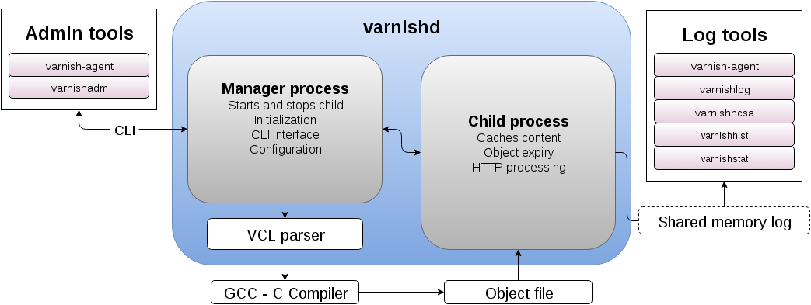
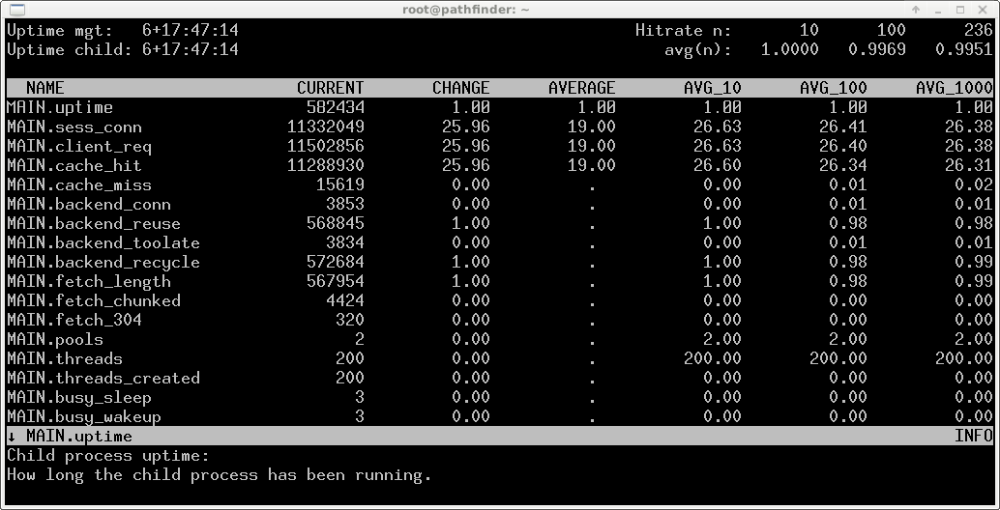
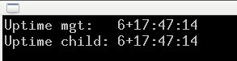
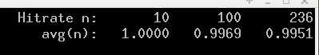

Architecture and operation
==========================

If you are working with Varnish, you need to know how to get information
from it, how to start and stop it and how to configure it.

This chapter explains the architecture of Varnish, how Varnish deals with
logs, best practices for running Varnish and debugging your Varnish
installation.

When you're done reading this chapter, you'll know how to distinguish what
goes into Varnish and what comes out in the other end. You'll have an idea
of what it takes to operate Varnish in the long-term and some very basic
tuning needs.

What you will not learn in this chapter is what every single Varnish
parameter is for. Advanced tuning is a topic for a later chapter, as it's
mostly not relevant for every-day operation. Neither will you see much of
the Varnish Configuration Language (VCL). VCL requires a chapter or two all
by itself.

The Varnish developers use numerous three letter acronyms for the
components and concepts that are covered in this chapter. We will only use
them sparsely and where they make sense. Many of them are ambiguous and
some refer to different things depending on context. An effort is made to
keep a list of the relevant acronyms and their meaning. That list can be
found at https://www.varnish-cache.org/trac/wiki/VTLA, with a copy
attached in Appendix B.

Architecture
------------

Varnish architecture is not just of academic interest. Every single tool
you use is affected by it, and understanding the architecture will
make it easier to understand how to use Varnish.

Varnish operates using two separate processes. The management process and
the child process. The child is where all the work gets done. A simplified
overview:

The management process, which is also the parent process, handles
initialization, parsing of VCL, interactive administration through the CLI
interface, and basic monitoring of the child process.

Varnish has two different logging mechanisms. The manager process will
typically log to `syslog`, like you would expect, but the child logs to a
shared memory log instead. This shared memory can be accessed by Varnish
itself and any tool that knows where to find the log and how to parse it.

A shared memory log was chosen over a traditional log file for two reasons.
First of all, it is quite fast, and doesn't eat up disk space. The second
reason is that a traditional log file is often limited in information.
Compromises have to be made because it is written to disk and could take up
a great deal of space if everything you might need during a debug session
was always included. With a shared memory log, Varnish can add all the
information it has, always. If you are debugging, you can extract
everything you need, but if all you want is statistics, that's all you
extract.

The shared memory log, abbreviated shmlog, is a round-robin style log file
which is typically about 85MB large. It is split in two parts. The
smallest bit is the part for counters, used to keep track of any part
of Varnish that could be covered by a number, e.g. number of cache hits,
number of objects, and so forth. This part of the shmlog is 1MB by default.

The biggest part of the shmlog is reserved for fifo-style log entries,
directly related to requests typically. This is 80MB by default. Once those
80MB are filled, Varnish will continue writing to the log from the top. If
you wish to preserve any of the data, you need to extract it before it's
overwritten. This is where the various Varnish tools comes into the
picture.

VCL is not a traditionally parsed configuration format, but a shim layer on
top of C and the Varnish run time library (VRT). You are not so much
configuring Varnish with VCL as programming it. Once you've written your
VCL file, Varnish will translate it to C and compile it, then link it
directly into the child process.

Both ``varnishadm`` and ``varnish-agent`` are tools that can influence a
running Varnish instance, while any tool that only works on the shmlog is
purely informational and has no direct impact on the running Varnish
instance.

Design principles of Varnish
----------------------------

Varnish is designed to solve real problems and then largely get out of your
way. If the solution to your problem is to buy more RAM, then Varnish isn't
going to try to work around that issue. Varnish relies on features provided
by 64-bit operating systems and multi-core hardware.

Varnish also uses a great deal of ``assert()`` statements and other fail
safes in the code base. An ``assert()`` statement is a very simple
mechanism. ``assert(x == 0);`` means "make sure x is 0". If x is `not` 0,
Varnish will abort. In most cases, that means the entire child process
shuts down, only to have the manager start it back up. You lose all
connections, you lose all cache.

Hopefully, you wont run into assert errors. They are there to handle what
is believed to be the unthinkable. A more realistic example can be:

- Create an object, called `foo`. Set ``foo.magic`` to ``0x123765``.
- Store `foo` in the cache.
- (time passes)
- Read `foo` from the cache.
- Assert that ``foo.magic`` is still ``0x123765``.

This is a simple safe guard against memory corruption, and is used for
almost all data structures that are kept around for a while in Varnish. An
arbitrary `magic` value is picked during development, and whenever the
object is used, that value is read back and checked. If it doesn't match,
your memory was corrupted. Either by something Varnish did or by the host
it's running on.

Assert errors are there to make sure that you don't use a corrupt system.
The theory is that if something so bad that the code doesn't account for it
happens, then it's better to just stop and start up. You might lose some
up-time (usually in the order of a couple of seconds), but at least your
Varnish instance is back up in a predictable state.

If Varnish does hit an assert error, it will (try to) log it to syslog. In
addition to that, it keeps the last `panic` message available through
``varnishadm panic.show``::

        # varnishadm panic.show 
        Child has not panicked or panic has been cleared
        Command failed with error code 300
        #

The different categories of configuration
-----------------------------------------

Varnish has three categories of configuration settings. Certain things
must be configured before Varnish starts and can't be changed during
run-time. These settings are few in number, and are provided on the command
line. Even among command line arguments, several can be changed during run
time to some degree. The working directory to be used and the management
interface are among the settings that are typically provided as command
line arguments.

The second category of configuration Varnish uses is the run-time
parameters. These can be changed after Varnish has started, but depending
on the nature of the parameter it could take some time before the change is
visible. Parameters can be changed through the CLI, but need to be added as
a command line argument in a startup script to be permanent.

Parameters usually change some purely operational aspect of Varnish, not
policy. Default values for Varnish parameters are frequently tuned between
Varnish releases as feedback from real-world use reaches developers. As
such, most parameters can be left to the default values. Some examples of
what parameters can modify is the number of threads Varnish can use, the
size of the shared memory log, what user to run as and default timeout
values.

Many of the command line arguments passed to ``varnishd`` are actually
short-hands for their respective parameters.

The third type of configuration primitive is the Varnish Configuration
Language script, usually just referred to as your VCL or VCL file. This is
where you will specify caching policies, what backends you have and how to
pick a backend. VCL can be changed at run-time with little or no penalty to
performance, but like parameters, changes are not retroactive. If your VCL
says "cache this for 5 years" and the content is cached, then changing your
VCL to "cache this for 1 minute" isn't going to alter the cache duration
for content that has already been cached.

VCL is easily the most complex part of Varnish, but you can get a lot done
with a few simple techniques. In this chapter, VCL is not a focus, but is
only briefly mentioned and used to avoid building bad habits.

To summarize:

Command line arguments
        Stored in startup-scripts. Takes effect on (re)starting Varnish.
        Some can be modified after startup, some can not. Often just a
        short-hand for setting default values for parameters. Examples:
        "how much memory should Varnish use", "what port should the
        management interface use", "what are the initial values for
        parameters"

Parameters
        Stored in startup-scripts, but can be changed at run-time. Upon
        re-start, the values from the startup scripts are used. Changes
        operational aspects of Varnish, often in great detail. Examples:
        "how large should the stack for a thread be", "what are the default
        values for cache duration", "what is the maximum amount of headers
        Varnish supports".

Varnish Configuration Language
        Stored in one or more separate VCL files, usually in
        ``/etc/varnish/``. Can be changed on-the-fly. Uses a custom-made
        configuration language to define caching policies. Examples:
        "Retrieve content for www.example.com from backend server at
        prod01.example.net", "Strip Cookie headers for these requests",
        "Output an error message for this URL".

Command line arguments
----------------------

Command line arguments are rarely entered directly, but usually kept in
``/lib/systemd/system/varnish.service`` or similar startup scripts.
Before we look at startup scripts, we'll look at running
``varnishd`` by hand.

Varnish hasn't got the best track record of verifying command line
arguments. Just because Varnish starts with the arguments you provided
doesn't mean Varnish actually used them as you expected. Make sure you
double check if you deviate from the standard usage.

``-a`` specifies what port Varnish listens to. Most installations simply
use ``-a :80``, but it's worth noting that you can have Varnish listening
on multiple sockets. This is especially useful in Varnish 4.1 where you can
have Varnish listen for regular HTTP traffic on port 80, and SSL-terminated
traffic through the PROXY protocol on 127.0.0.1:1443 (for example). In
Varnish 4.0, this is accomplished by having a white-space separated list of
``address:port`` pairs::

        varnishd -b localhost:8080 ... -a "0.0.0.0:80 127.0.0.1:81"

In Varnish 4.1, you can supply multiple ``-a`` options instead.

Be careful. Varnish 4.0 will still accept multiple ``-a`` options, but only
the last one will be used.

Another subtle detail worth noting is that the ``varnishd`` default value
for ``-a`` is listening to port 80. But we have seen in previous
installations that a default Varnish installation listens on port 6081, not
port 80.

This is because port 6081 is a convention specified in startup scripts.
Here's an example from a default Debian Jessie installation's
``/lib/systemd/system/varnish.service``::

        ExecStart=/usr/sbin/varnishd -a :6081 -T localhost:6082 \
                        -f /etc/varnish/default.vcl \
                        -S /etc/varnish/secret \
                        -s malloc,256m

In addition to telling Varnish where to listen, you need to tell it where
to get content. You can achieve this through the ``-b <address[:port]>``
argument, but that is typically limited to testing. In almost all other
cases you will want to specify an ``-f file`` option instead. ``-f file``
tells Varnish where to find the VCL file it should use, and that VCL file
will have to list any backend servers Varnish should use. When you use
``-b``, Varnish generates a simple VCL file for you behind the scenes::

        # varnishd -b pathfinder.kly.no:6085
        # varnishadm vcl.show boot
        vcl 4.0;
        backend default {
            .host = "pathfinder.kly.no:6085";
        }

There are two more important options that all proper Varnish installations use:
``-T`` and ``-S``. The ``-T`` option specifies a listening socket for Varnish's
management CLI. Since its introduction, the convention has been to run the CLI
interface on ``127.0.0.1:6082``, and this is seen in most Varnish
distributions. However the actual default for the ``varnishd`` binary in
Version 4 and newer is a random port and secret file.

The ``-S`` argument lets you specify a file which contains a shared secret
that management tools can use to authenticate to Varnish. This is referred
to as the `secret file` and should contain data, typically 256 bytes randomly
generated at installation. The content is never sent over the network, but
used to verify clients. All tools that are to interact with Varnish must be
able to read the content of this file.

``varnishadm`` and other tools that use the management port will read the
``-T`` and ``-S`` argument from the shmlog if you don't provide them on the
command line. As seen here::

        # varnishd -b localhost:8080
        # netstat -nlpt
        Active Internet connections (only servers)
        Proto Recv-Q Send-Q Local Address      Foreign Address  State PID/Program name
        tcp        0      0 127.0.0.1:37860    0.0.0.0:*        LISTEN 2172/varnishd   
        tcp        0      0 0.0.0.0:80         0.0.0.0:*        LISTEN -               
        tcp6       0      0 :::80              :::*             LISTEN -               
        tcp6       0      0 ::1:35863          :::*             LISTEN 2172/varnishd   
        # varnishadm status
        Child in state running
        # varnishadm -T localhost:37860 status
        Authentication required
        # varnishadm -T localhost:37860 -S /var/lib/varnish/c496eeac1030/_.secret status
        Child in state running

``varnishadm`` works with zero arguments, but if you add ``-T`` you also
have to specify the ``-S`` argument. ``varnishadm`` can re-use multiple
options from ``varnishd`` (``-T``, ``-S``, ``-n``).

Many Varnish installations default to using ``-S /etc/varnish/secret``.
This is a good habit in case you end up with multiple Varnish instances
over multiple machines.

Last, but not least, you will want to specify an ``-s`` option. This
is used to set how large Varnish's cache will be, and what underlying method is
used to cache. Varnish provides three storage backends, called ``mallco``,
``file`` and ``persistent``. The most used, by far, is ``malloc``. It works
by allocating the memory needed with the ``malloc()`` system call, and adds
as little logic as possible on top of it. Under the hood, Varnish uses the
`jemalloc` library to achieve better performance for multi-threaded
applications. If you specify a larger cache than you have physical memory,
it is up to your operating system to utilize swap instead.

The second alternative is ``file``. This allocates a file on your file
system, then uses ``mmap()`` to map it into memory. Varnish never makes an
attempt to commit the content to disk. The file is merely provided in case
your cache is larger than your physical memory. It is not possible to
re-use a file previously used with ``-s file`` to regain the cached content
you had before a restart or similar event. What is written to the file is
for all practical purposes random.

The last alternative is ``persistent``. This is by far the most complex
alternative, and is meant to provide a persistent storage of cache between
restarts. It doesn't make a guarantee that all of the content is there,
though.

As of Varnish 4.1, both ``persistent`` and ``file`` are deprecated.
Persistent is deprecated because it is very complex and has not received
near enough testing and feedback to be regarded as production quality. It
is used by several large Varnish installations, but use at your own risk.
For ``file``, the deprecation is less severe. The ``malloc`` alternative is
simply better for most of us.

If you do end up using ``-s malloc``, the next question is usually "how
large should the cache be?". There is no easy answer to this, but as a
rule, starting out with 80% of the memory your machine has available is
usually safe. Varnish will use a little more memory than just what you
specify for ``-s malloc``, so you need to anticipate that too. How much
more depends on your traffic. Many small objects have a larger overhead,
while large objects have less of an overhead.

To summarize:

``-a <listen address>``
        Listen address. Typically set to :80. Format for specifying multiple listening
        sockets varies between Varnish 4.0 and 4.1.

``-b <address[:port]>``
        Specify backend address. Mostly for testing, mutually exclusive
        with ``-f`` (VCL).

``-f <vclfile>``
        Specify path to VCL file to use at startup.

``-T address:port``
        Set management/CLI listening address. Used for controlling Varnish.
        ``varnishd`` default is random, but ``127.0.0.1:6082`` is a common
        value used in default installations.

``-S <secret file>``
        Used to secure the management CLI. Points to a file with random
        data that both ``varnishd`` and management clients like
        ``varnishadm`` must have access to. Often set to
        ``/etc/varnish/secret``. Shouldn't matter where it is as long as
        ``varnishadm`` can read it and the shmlog.

``-s <method,options>``
        Used to control how large the cache can be and the storage engine.
        Alternatives are ``-s persistent,(options)``, ``-s
        file,(options)`` and ``-s malloc,(size)``. ``-s malloc,256m`` (or
        more) is strongly recommended.

Other useful ``varnishd`` arguments
-----------------------------------

``-n dir`` is used to control the Varnish working directory and name. The
directory argument can either just be a simple name, like ``-n
frontserver``, in which case Varnish will use a working directory named
``frontserver`` in its default path, typically
``/var/lib/varnish/frontserver/``. You can also provide a full path
instead. Whenever you alter ``-n``, you need to provide that same ``-n``
argument to any Varnish-tool you want to use. There are two use cases for
``-n``:

1. Running multiple Varnish instances on the same machine. Give each a
   different ``-n`` to make this work.
2. Run ``varnishd`` as a user that doesn't have access to the default
   working directory. This can be handy during development or testing to
   avoid having to start Varnish as the root user.

If you look in the working directory, you can see your shmlog file and the
compiled VCL, among other things::

        # ls /var/lib/varnish/
        # varnishd -b localhost:8080
        # ls /var/lib/varnish/
        3da4db675c6b
        # ls /var/lib/varnish/3da4db675c6b/
        _.secret  _.vsm  vcl.QakoKN_T.so
        # varnishd -b localhost:8110 -a :81 -n test
        # ls /var/lib/varnish/
        3da4db675c6b  test
        # ls /var/lib/varnish/test/
        _.secret  _.vsm  vcl.Lnayret_.so
        # netstat -nlpt
        Active Internet connections (only servers)
        Proto Recv-Q Send-Q Local Address    Foreign Address   State    PID/Program name
        tcp        0      0 127.0.0.1:34504  0.0.0.0:*         LISTEN   502/varnishd    
        tcp        0      0 127.0.0.1:42797  0.0.0.0:*         LISTEN   262/varnishd    
        tcp        0      0 0.0.0.0:80       0.0.0.0:*         LISTEN   -               
        tcp        0      0 0.0.0.0:81       0.0.0.0:*         LISTEN   -               
        tcp6       0      0 ::1:39843        :::*              LISTEN   262/varnishd    
        tcp6       0      0 :::80            :::*              LISTEN   -               
        tcp6       0      0 :::81            :::*              LISTEN   -               
        tcp6       0      0 ::1:43220        :::*              LISTEN   502/varnishd    

A common task you have is to verify that your VCL is correct before you try
loading it. This can be done implicitly with the ``-C`` option. It will
either give you a syntax error for your VCL or a whole lot of C code, which
happens to be your VCL translated to C::

        # cat /etc/varnish/test.vcl 
        vcl 4.0;

        broken VCL backend localhost {
                .host = "localhost";
                .port = "8080";
        }
        # varnishd -C -f /etc/varnish/test.vcl 
        Message from VCC-compiler:
        Expected one of
                'acl', 'sub', 'backend', 'director', 'probe', 'import',  or 'vcl'
        Found: 'broken' at
        ('input' Line 3 Pos 1)
        broken VCL backend localhost {
        ######------------------------

        Running VCC-compiler failed, exited with 2

        VCL compilation failed
        # echo $?
        2

Note that the return-code of ``varnishd -C -f vcl`` is false if the VCL
fails to compile. Fixing the VCL::

        # cat /etc/varnish/test-ok.vcl 
        vcl 4.0;

        backend localhost {
                .host = "localhost";
                .port = "8080";
        }
        # varnishd -C -f /etc/varnish/test-ok.vcl
        /* ---===### include/vcl.h ###===--- */

        /*
         * NB:  This file is machine generated, DO NOT EDIT!
         *
         * Edit and run generate.py instead
         */

        struct vrt_ctx;
        struct req;
        (......)

        # echo $?
        0

A more useful example::

        # varnishd -C -f /etc/varnish/test.vcl >/dev/null && echo "VCL OK" || echo "VCL NOT OK" 
        Message from VCC-compiler:
        Expected one of
                'acl', 'sub', 'backend', 'director', 'probe', 'import',  or 'vcl'
        Found: 'broken' at
        ('input' Line 3 Pos 1)
        broken VCL backend localhost {
        ######------------------------

        Running VCC-compiler failed, exited with 2

        VCL compilation failed
        VCL NOT OK
        # varnishd -C -f /etc/varnish/test-ok.vcl >/dev/null && echo "VCL OK" || echo "VCL NOT OK" 
        VCL OK

Perhaps not the prettiest syntax check, but it gets the job done.

There are other options, but they are quite advanced and generally best
left alone. We will cover them in more advanced chapters.

Startup scripts
---------------

Varnish Cache development focuses on GNU/Linux and FreeBSD, with some
occasional attention directed towards Solaris.

But the vast majority of Varnish Cache operational focus is on GNU/Linux,
more specifically on Fedora-derived systems, such as Red Hat Enterprise
Linux (RHEL), Fedora and CentOS, or on Debian and Ubuntu. These are the
distributions where Varnish packaging is best maintained and they deliver
top-quality Varnish packages.

The startup scripts provided for those distributions are solid, and should
be used whenever possible.

Since before GNU/Linux existed, System V-styled init scripts have been used
to boot Unix-like machines. This has been the case for GNU/Linux too. Until
recently, when ``upstart`` and ``systemd`` came around. By now, all the
major GNU/Linux use or are preparing to use ``systemd``. That means that if
you have older installations, the specific way Varnish is started will be
different than how it's started on newer installations. In the end, though,
it all boils down to one thing: you have to know into which file you need
to add your ``varnishd`` start-up arguments, and what commands to use to
start and stop it.

Where your distribution keeps its configuration will vary, but in short:

- They all keep VCL and secret files in ``/etc/varnish`` by default.
- With systemd, startup arguments are kept in
  ``/lib/systemd/system/varnish.service`` for both distribution families.
  That file should be copied to ``/etc/systemd/system/varnish.service`` if
  you mean to modify it.
- Recent RHEL/Fedora packages use ``/etc/varnish/varnish.params``. A
  similar strategy is expected for other distributions too in the future.
- Before systemd, Debian/Ubuntu kept startup arguments in
  ``/etc/default/varnish``.
- Before systemd, Red Had Enterprise Linux/CentOS/Fedora kept startup
  arguments in ``/etc/sysconfig/varnish``.

For starting and stopping, it's a little simpler:

- If you have systemd, use ``systemctl
  <start|stop|reload|restart> varnish.service``.
- If have System V scripts, use ``service varnish
  <stop|start|reload|restart>``.

To enable or disable starting Varnish at boot, you can use ``systemctl
<enable|disable> varnish.service`` on Systemd-systems.

Parameters
----------

Run-time parameters in Varnish allow you to modify aspects of Varnish that
should normally be left alone. The default values are meant to suite the
vast majority of installations, and usually do. However, parameters exist
for a reason.

Varnish 4.0 has 93 parameters, which can be seen using ``varnishadm`` on a
running Varnish server::

        # varnishadm param.show
        acceptor_sleep_decay       0.9 (default)
        acceptor_sleep_incr        0.001 [s] (default)
        acceptor_sleep_max         0.050 [s] (default)
        auto_restart               on [bool] (default)
        ban_dups                   on [bool] (default)
        ban_lurker_age             60.000 [s] (default)
        ban_lurker_batch           1000 (default)
        ban_lurker_sleep           0.010 [s] (default)
        between_bytes_timeout      60.000 [s] (default)
        (...)

You can also get detailed information on individual parameters::

        # varnishadm param.show default_ttl
        default_ttl
                Value is: 120.000 [seconds] (default)
                Default is: 120.000
                Minimum is: 0.000

                The TTL assigned to objects if neither the backend nor the VCL
                code assigns one.

                NB: This parameter is evaluated only when objects are
                created.To change it for all objects, restart or ban
                everything.

Changing a parameter takes effect immediately, but is not always
immediately visible, as the above `default_ttl` demonstrates. Changing
`default_ttl` will affect any new object entered into the cache, but not
what is already there.

Many of the parameters Varnish exposes are meant for tweaking very
intricate parts of Varnish, and even the developers may not know the
exact consequence of modifying it, this is usually flagged through a
warning, e.g.::

        # varnishadm param.show timeout_linger
        timeout_linger
                Value is: 0.050 [seconds] (default)
                Default is: 0.050
                Minimum is: 0.000

                How long time the workerthread lingers on an idle session
                before handing it over to the waiter.
                When sessions are reused, as much as half of all reuses happen
                within the first 100 msec of the previous request completing.
                Setting this too high results in worker threads not doing
                anything for their keep, setting it too low just means that
                more sessions take a detour around the waiter.

                NB: We do not know yet if it is a good idea to change this
                parameter, or if the default value is even sensible. Caution
                is advised, and feedback is most welcome.

You can change parameters using ``varnishadm param.set``::

        # varnishadm param.set default_ttl 15

        # varnishadm param.show default_ttl  
        default_ttl
                Value is: 15.000 [seconds]
                Default is: 120.000
                Minimum is: 0.000

                The TTL assigned to objects if neither the backend nor the VCL
                code assigns one.

                NB: This parameter is evaluated only when objects are
                created.To change it for all objects, restart or ban
                everything.

However, this is stored exclusively in the memory of the running Varnish
instance, if you want to make it permanent, you need to add it to the
``varnishd`` command line as a ``-p`` argument. E.g.::

        # varnishd -b localhost:1111 -p default_ttl=10 -p prefer_ipv6=on

The usual work flow for adjusting parameters is:

1. Start Varnish
2. Modify parameters through ``varnishadm``
3. Test
4. Go back to step 2 if it doesn't work as intended
5. When it works as intended, save the changes to your startup script as
   ``-p`` arguments.

Most parameters can and should be left alone, but reading over the list is
a good idea. The relevant parameters are referenced when we run across the
functionality.

Tools: ``varnishadm``
---------------------

Controlling a running Varnish instance is accomplished with the
``varnishadm`` tool, which talks to the management process through the CLI
interface.

You can run ``varnishadm`` in two different modes: interactive, or with the
CLI command you wish to issue as part of the ``varnishadm`` command line.
The examples have so far used the latter form, e.g.::

        # varnishadm status
        Child in state running

If you just type ``varnishadm``, you enter the interactive mode::

        # varnishadm 
        200        
        -----------------------------
        Varnish Cache CLI 1.0
        -----------------------------
        Linux,4.2.0-0.bpo.1-amd64,x86_64,-smalloc,-smalloc,-hcritbit
        varnish-4.0.2 revision bfe7cd1

        Type 'help' for command list.
        Type 'quit' to close CLI session.

        varnish> help
        200        
        help [command]
        ping [timestamp]
        auth response
        quit
        banner
        status
        start
        stop
        vcl.load <configname> <filename>
        vcl.inline <configname> <quoted_VCLstring>
        vcl.use <configname>
        vcl.discard <configname>
        vcl.list
        param.show [-l] [<param>]
        param.set <param> <value>
        panic.show
        panic.clear
        storage.list
        vcl.show <configname>
        backend.list
        backend.set_health matcher state
        ban <field> <operator> <arg> [&& <field> <oper> <arg>]...
        ban.list
        
        varnish> quit
        500        
        Closing CLI connection
        # 

Both modes are functionally identical. One benefit of using the interactive
mode is that you don't have to worry about yet an other level of quotation
marks once you start dealing with more complex commands than ``vcl.load``
and ``param.list``. For now, it's just a matter of style. An other
difference is that ``varnishadm`` in interactive mode also offer
rudimentary command line completion, something your shell might not.

The CLI, and ``varnishadm`` by extension, uses HTTP-like status codes.
If a command is issued successfully, you will get a ``200`` in return.
These are just similar to HTTP, though, and do not match fully.

When you are using ``varnishadm``, you are communicating with Varnish
through the management process, over a regular TCP connection. It is
possible to run ``varnishadm`` from a remote host, even if it is not
generally advised. To accomplish this, you must:

- Use a ``-T`` option that binds the CLI to an externally-available port.
  E.g.: Not ``-T localhost:6082``.
- Copy the `secret file` from the Varnish host to the one you wish to run
  ``varnishadm`` from.
- Make sure all firewalls etc are open.
- Issue ``varnishadm`` with ``-T`` and ``-S``.

However, be advised: CLI communication is *not* encrypted. The authentication
is reasonably secure, in that it is not directly vulnerable to replay
attacks (the shared secret is never transmitted), but after authentication,
the connection can be hijacked. Never run ``varnishadm`` over an untrusted
network. In fact, the best practice is to keep it bound to localhost.

If you do need to communicate with it, you can always use SSH. You do not
need root-privileges to run ``varnishadm``, the user just needs
read-permission to the secret file and either read permission to the shmlog
or knowledge of the ``-T`` and ``-S`` arguments.

Tools: ``varnishstat``
----------------------

``varnishstat`` is the simplest, yet one of the most useful log-related
tools. With no arguments, ``varnishstat`` opens an interactive view of
Varnish-counters:

``varnishstat`` reads counters from the shmlog and makes sense of them.
It can also be accessed in manners better suited for scripting, either
``varnishstat -1`` (plain text), ``varnishstat -j`` (JSON) or ``varnishstat
-x`` (XML). The real-time mode collects data over time, to provide you with
meaningful interpretation. Knowing that you have had 11278670 cache hits
over the last six and a half days might be interesting, but knowing that
you have 25.96 cache hits per seconds right now is far more useful. The
same can be achieved through ``varnishtat -1`` and similar by executing the
command twice and comparing the values.

Looking at the upper left corner of the screenshot above, you'll see some
durations:

This tells you the uptime of the management and child process. Every once
in a while, these numbers might differ. That could happen if you manually
issue a ``stop`` command followed by a ``start`` command through
``varnishadm``, or if Varnish is hitting a bug and throwing an ``assert()``
error.

In the upper right corner, you will see six numbers:

The first line tells you the time frame of the second. It will start at "1
1   1" and grow to eventually read "10  100  1000". When you start
``varnishstat``, it only has one second of data, but it collects up to a
thousand seconds.

The ``avg(n)`` line tells you the cache hit rate during the last ``(n)``
seconds, where, `n` refers to the line above. In this example, we have a
cache hit rate of 1.0 (aka: 100%) for the last 10 seconds, 0.9969 (99.69%)
for the last 100 seconds and 0.9951 (99.51%) for the last 236 seconds.
Getting a high cache hit rate is almost always good, but it can be a bit
tricky. It reports how many client requests were served by cache hits, but
it doesn't say anything about how many backend requests were triggered. If
you are using grace mode, cache hit rate can be 100% while you are issuing
requests to the web server.

The main area shows 7 columns:

``NAME``
        This one should be obvious. The name of the counter.

``CURRENT``
        The actual value. This is the only value seen in ``varnishstat -j``
        and similar.

``CHANGE``
        "Change per second". Or put an other way: The difference between
        the current value and the value read a second earlier. Can be read
        as "cache hit per second" or "client reuqests per second".

``AVERAGE``
        Average change of the counter, since start-up. The above example
        has had 19 client requests per second on average. It's basically
        ``CURRENT`` divided by ``MAIN.uptime``.

``AVERAGE_n``
        Similar the cache hit rate, this is the average over the last `n`
        seconds. Note that the header says ``AVERAGE_1000`` immediately,
        but the actual time period is the same as the ``Hitrate n:`` line,
        so it depends on how long ``varnishstat`` has been running.

An interactive ``varnishstat`` does not display all counters by default.
It will hide any counter with a value of 0, in the interest of
saving screen real-estate. In addition to hiding counters without a value,
each counter has a verbosity level attached to it. By default, it only
displays informational counters.

A few key bindings are worth mentioning:

``<UP>``/``<DOWN>``/``<Page UP>``/``<Page Down>``
        Scroll the list of counters.

``<d>``
        Toggle displaying unseen counters.
``<v>``
        Similar to ``<d>``, but cycles through verbosity levels
        instead of toggling everything.
``<q>``
        Quit.

A note on threads
-----------------

Now that you've been acquainted with parameters and counters, it might be
worth looking at threads.

Varnish uses one `worker thread` per active TCP connection. A typical user
can easily set up 5 or more concurrent TCP sessions, depending on the
content and browser. Varnish also organizes worker threads into `thread
pools`. Each pool of threads is managed by a separate thread, and can grow
and shrink on demand. By default, Varnish uses two thread pools, this can
be tuned with the ``thread_pools`` parameter.

Each thread pool starts up with ``thread_pool_min`` threads, by default,
that is 100 threads. The upper limit for threads used per thread pool is
``thread_pool_max``, which in turn defaults to 5000. Even when this limit
is reached, Varnish has several layers of queues that will be used. You can
see the state of the session queue in the counter called
``MAIN.thread_queue_len``. You can also observe how many threads are used
by looking at ``MAIN.threads``. Since Varnish also removes threads that are
unused, looking at ``MAIN.threads_created`` is also interesting. If you see
a high number of threads created, that means Varnish is spawning new
threads frequently, only to remove them later.

Traditionally, thread parameters were some of the few parameters that
always made sense to tune. This is no longer the case. Originally, Varnish
shipped with very conservative default values where Varnish would start
with just 10 threads total. Today, it uses 200 by default, with a maximum
of 10000. Even 200 can be a bit low, but it's nowhere near as drastic as
what the old default of 10 threads was. As such, most sites will operate
very well using default thread parameters today.

It's worth repeating a small detail here: The thread parameters are per
thread pool. That means that:

- Setting ``thread_pools=1`` and ``thread_pool_min=10`` gives you a minimum
  of 10 threads.
- Setting ``thread_pools=2`` and ``thread_pool_min=100`` gives you a minimum
  of 200 threads. (this is the default).
- Setting ``thread_pools=5`` and ``thread_pool_min=10`` gives you a minimum
  of 50 threads.

And so forth. If you search the web, you might also run into pages that
suggest setting ``thread_pools`` to the same number as the number of CPU
cores you have available. This was believed to be advantageous, but further
testing and experience has demonstrated that the biggest gain is changing
it from 1 thread pool to 2. Any number above 2 doesn't seem to make a
significant difference. On the other hand, a value of 2 is known to work
very well.

In addition to worker threads, which make up the bulk of the threads
Varnish uses, there are several other more specialized threads that you
rarely have to deal with. That can be the ban lurker thread, expiry thread
or acceptor thread, for example. Looking at a Varnish 4.0 installation on
GNU/Linux, you can see the consequence of this::

        # varnishstat -1f MAIN.threads
        MAIN.threads               200          .   Total number of threads
        # pidof varnishd
        19 18
        # grep Threads /proc/19/status
        Threads:        217

The ``MAIN.threads`` counter states 200 threads, but investigating the
``/proc`` filesystem, you can see that the worker process is actually using
217 threads. The worker threads are the only ones that we usually have to
worry about, though.

In summary: Threads rarely need tuning in Varnish 4, and the old best
practices no longer apply. Varnish will use one thread per active TCP
connection, and scale automatically.

Tools: ``varnishlog``
---------------------

Where ``varnishstat`` is a simple way to view and work with counters in
Varnish, ``varnishlog`` is a simple way to view and work with the rest of
the shmlog. With no arguments, it will output all log data in real time in
a semi-ordered manner. However, most Varnish installations has far too much
traffic for that to be useful. You need to be able to filter and group data
to be able to use ``varnishlog`` productively.

Normally ``varnishlog`` will only parse new data. Since the shmlog contains
up to 80MB of old data, it's some times useful to look at this data too.
This can be achieved with the ``-d`` argument.

You can also select if you want backend-traffic (``-b``), client-traffic
(``-c``) or everything. By default, you get everything. Let's take a look
at a single request::

        # varnishlog -cd
        *   << Request  >> 2         
        -   Begin          req 1 rxreq
        -   Timestamp      Start: 1450446455.943883 0.000000 0.000000
        -   Timestamp      Req: 1450446455.943883 0.000000 0.000000
        -   ReqStart       ::1 59310
        -   ReqMethod      GET
        -   ReqURL         /
        -   ReqProtocol    HTTP/1.1
        -   ReqHeader      Host: localhost
        -   ReqHeader      Connection: keep-alive
        -   ReqHeader      Accept-Encoding: gzip, deflate
        -   ReqHeader      Accept: */*
        -   ReqHeader      User-Agent: HTTPie/0.8.0
        -   ReqHeader      X-Forwarded-For: ::1
        -   VCL_call       RECV
        -   VCL_return     hash
        -   ReqUnset       Accept-Encoding: gzip, deflate
        -   ReqHeader      Accept-Encoding: gzip
        -   VCL_call       HASH
        -   VCL_return     lookup
        -   Debug          "XXXX MISS"
        -   VCL_call       MISS
        -   VCL_return     fetch
        -   Link           bereq 3 fetch
        -   Timestamp      Fetch: 1450446455.945022 0.001139 0.001139
        -   RespProtocol   HTTP/1.1
        -   RespStatus     200
        -   RespReason     OK
        -   RespHeader     Date: Fri, 18 Dec 2015 13:47:35 GMT
        -   RespHeader     Server: Apache/2.4.10 (Debian)
        -   RespHeader     Last-Modified: Thu, 03 Dec 2015 12:43:12 GMT
        -   RespHeader     ETag: "2b60-525fdbbd7f800-gzip"
        -   RespHeader     Vary: Accept-Encoding
        -   RespHeader     Content-Encoding: gzip
        -   RespHeader     Content-Type: text/html
        -   RespHeader     X-Varnish: 2
        -   RespHeader     Age: 0
        -   RespHeader     Via: 1.1 varnish-v4
        -   VCL_call       DELIVER
        -   VCL_return     deliver
        -   Timestamp      Process: 1450446455.945037 0.001154 0.000015
        -   Debug          "RES_MODE 8"
        -   RespHeader     Transfer-Encoding: chunked
        -   RespHeader     Connection: keep-alive
        -   RespHeader     Accept-Ranges: bytes
        -   Timestamp      Resp: 1450446455.945157 0.001274 0.000119
        -   Debug          "XXX REF 2"
        -   ReqAcct        130 0 130 356 3092 3448
        -   End            

This is a lot of data, but represents a single client request. If your
Varnish server is slightly more used than this one, you will have far more
log entries.

The very first column is used to help you group requests. The single ``*``
tells you that this particular line is just informing you about the
following grouping. ``<< Request  >> 2`` tells you that the following is
grouped as a request, and the `vxid` is 2. A `vixid` is an ID attached to
all log records. You will also see it in the response header ``X-Varnish``.

Next, you see what is more typical entries. Each log line starts with a
``-`` to indicate that it's related to the above grouping, using the same
`vxid`. Other grouping methods might have more dashes here to indicate what
happened first and last. The actual grouping is a logic done in the
``varnishlog`` tool itself, using information from the shmlog. It is
useful, because the shmlog is the result of hundreds, potentially thousands
of threads writing to a log at the same time. Without grouping it, tracking
a single request would be very hard.

Each line starts with a `vxid` followed by a `log tag`. Each type of tag
has a different format, documented in the ``vsl(7)`` manual page. In our
example, the first real log line has the `tag` ``Begin``.

You can tell ``varnishlog`` to only output some tags using the ``-i``
command line argument::

        # varnishlog -d -i ReqURL
        *   << BeReq    >> 3         

        *   << Request  >> 2         
        -   ReqURL         /

        *   << Session  >> 1         

        *   << BeReq    >> 32771     

        *   << Request  >> 32770     
        -   ReqURL         /demo/

        *   << Session  >> 32769     

This also demonstrate why grouping is sometimes unwanted. You can change
grouping method using ``-g``. Or disable it entirely with ``-g raw``::

        # varnishlog -d -g raw -i ReqURL
                 2 ReqURL         c /
             32770 ReqURL         c /demo/

Here you can see the `vxid` directly, instead of a ``-``.

You can also exclude individual tags with ``-x``, or use a regular expression
to match their content using ``-I``. The latter can be interesting if you want
to look at a specific header.

More importantly, however, is the use of the ``-q`` option, to specify a `VSL
query`. VSL stands for `Varnish Shared memory Log` and refers to the part
of the log we are working with, and a VSL query allows you to filter it
intelligently. It is documented in the manual page ``vsl-query(7)``.

Let's look at the difference between the default (``vxid``) grouping and
``request`` grouping, while using a VSL query::

        # varnishlog -d -q 'ReqUrl eq "/demo/"'
        *   << Request  >> 32770     
        -   Begin          req 32769 rxreq
        -   Timestamp      Start: 1450447223.693214 0.000000 0.000000
        -   Timestamp      Req: 1450447223.693214 0.000000 0.000000
        -   ReqStart       ::1 59320
        -   ReqMethod      GET
        -   ReqURL         /demo/
        -   ReqProtocol    HTTP/1.1
        -   ReqHeader      Host: localhost
        -   ReqHeader      Connection: keep-alive
        -   ReqHeader      Accept-Encoding: gzip, deflate
        -   ReqHeader      Accept: */*
        -   ReqHeader      User-Agent: HTTPie/0.8.0
        -   ReqHeader      X-Forwarded-For: ::1
        -   VCL_call       RECV
        -   VCL_return     hash
        -   ReqUnset       Accept-Encoding: gzip, deflate
        -   ReqHeader      Accept-Encoding: gzip
        -   VCL_call       HASH
        -   VCL_return     lookup
        -   Debug          "XXXX MISS"
        -   VCL_call       MISS
        -   VCL_return     fetch
        -   Link           bereq 32771 fetch
        -   Timestamp      Fetch: 1450447223.693667 0.000454 0.000454
        -   RespProtocol   HTTP/1.1
        -   RespStatus     404
        -   RespReason     Not Found
        -   RespHeader     Date: Fri, 18 Dec 2015 14:00:23 GMT
        -   RespHeader     Server: Apache/2.4.10 (Debian)
        -   RespHeader     Content-Type: text/html; charset=iso-8859-1
        -   RespHeader     X-Varnish: 32770
        -   RespHeader     Age: 0
        -   RespHeader     Via: 1.1 varnish-v4
        -   VCL_call       DELIVER
        -   VCL_return     deliver
        -   Timestamp      Process: 1450447223.693677 0.000463 0.000010
        -   RespHeader     Content-Length: 280
        -   Debug          "RES_MODE 2"
        -   RespHeader     Connection: keep-alive
        -   Timestamp      Resp: 1450447223.693712 0.000499 0.000036
        -   Debug          "XXX REF 2"
        -   ReqAcct        135 0 135 232 280 512
        -   End            

With the default grouping, we see just the client request and response.
Reading the details, the ``Link  bereq 32771 fetch`` line tells us that
this request is linked to a different one with vxid 32771. Also, the
``VCL_return fetch`` indicates that (the default) VCL told Varnish to fetch
the data.

Using a different grouping mode, you can see the linked backend request
too. Switching to ``-g request``, the output includes the linked request
too::

        # varnishlog -d -g request -q 'ReqUrl eq "/"'
        *   << Request  >> 2         
        -   Begin          req 1 rxreq
        -   Timestamp      Start: 1450446455.943883 0.000000 0.000000
        -   Timestamp      Req: 1450446455.943883 0.000000 0.000000
        -   ReqStart       ::1 59310
        -   ReqMethod      GET
        -   ReqURL         /
        -   ReqProtocol    HTTP/1.1
        -   ReqHeader      Host: localhost
        -   ReqHeader      Connection: keep-alive
        -   ReqHeader      Accept-Encoding: gzip, deflate
        -   ReqHeader      Accept: */*
        -   ReqHeader      User-Agent: HTTPie/0.8.0
        -   ReqHeader      X-Forwarded-For: ::1
        -   VCL_call       RECV
        -   VCL_return     hash
        -   ReqUnset       Accept-Encoding: gzip, deflate
        -   ReqHeader      Accept-Encoding: gzip
        -   VCL_call       HASH
        -   VCL_return     lookup
        -   Debug          "XXXX MISS"
        -   VCL_call       MISS
        -   VCL_return     fetch
        -   Link           bereq 3 fetch
        -   Timestamp      Fetch: 1450446455.945022 0.001139 0.001139
        -   RespProtocol   HTTP/1.1
        -   RespStatus     200
        -   RespReason     OK
        -   RespHeader     Date: Fri, 18 Dec 2015 13:47:35 GMT
        -   RespHeader     Server: Apache/2.4.10 (Debian)
        -   RespHeader     Last-Modified: Thu, 03 Dec 2015 12:43:12 GMT
        -   RespHeader     ETag: "2b60-525fdbbd7f800-gzip"
        -   RespHeader     Vary: Accept-Encoding
        -   RespHeader     Content-Encoding: gzip
        -   RespHeader     Content-Type: text/html
        -   RespHeader     X-Varnish: 2
        -   RespHeader     Age: 0
        -   RespHeader     Via: 1.1 varnish-v4
        -   VCL_call       DELIVER
        -   VCL_return     deliver
        -   Timestamp      Process: 1450446455.945037 0.001154 0.000015
        -   Debug          "RES_MODE 8"
        -   RespHeader     Transfer-Encoding: chunked
        -   RespHeader     Connection: keep-alive
        -   RespHeader     Accept-Ranges: bytes
        -   Timestamp      Resp: 1450446455.945157 0.001274 0.000119
        -   Debug          "XXX REF 2"
        -   ReqAcct        130 0 130 356 3092 3448
        -   End            
        **  << BeReq    >> 3         
        --  Begin          bereq 2 fetch
        --  Timestamp      Start: 1450446455.943931 0.000000 0.000000
        --  BereqMethod    GET
        --  BereqURL       /
        --  BereqProtocol  HTTP/1.1
        --  BereqHeader    Host: localhost
        --  BereqHeader    Accept: */*
        --  BereqHeader    User-Agent: HTTPie/0.8.0
        --  BereqHeader    X-Forwarded-For: ::1
        --  BereqHeader    Accept-Encoding: gzip
        --  BereqHeader    X-Varnish: 3
        --  VCL_call       BACKEND_FETCH
        --  VCL_return     fetch
        --  BackendOpen    17 default(127.0.0.1,,8080) 127.0.0.1 54806 
        --  Backend        17 default default(127.0.0.1,,8080)
        --  Timestamp      Bereq: 1450446455.944036 0.000105 0.000105
        --  Timestamp      Beresp: 1450446455.944924 0.000993 0.000888
        --  BerespProtocol HTTP/1.1
        --  BerespStatus   200
        --  BerespReason   OK
        --  BerespHeader   Date: Fri, 18 Dec 2015 13:47:35 GMT
        --  BerespHeader   Server: Apache/2.4.10 (Debian)
        --  BerespHeader   Last-Modified: Thu, 03 Dec 2015 12:43:12 GMT
        --  BerespHeader   ETag: "2b60-525fdbbd7f800-gzip"
        --  BerespHeader   Accept-Ranges: bytes
        --  BerespHeader   Vary: Accept-Encoding
        --  BerespHeader   Content-Encoding: gzip
        --  BerespHeader   Content-Length: 3078
        --  BerespHeader   Content-Type: text/html
        --  TTL            RFC 120 -1 -1 1450446456 1450446456 1450446455 0 0
        --  VCL_call       BACKEND_RESPONSE
        --  VCL_return     deliver
        --  Storage        malloc s0
        --  ObjProtocol    HTTP/1.1
        --  ObjStatus      200
        --  ObjReason      OK
        --  ObjHeader      Date: Fri, 18 Dec 2015 13:47:35 GMT
        --  ObjHeader      Server: Apache/2.4.10 (Debian)
        --  ObjHeader      Last-Modified: Thu, 03 Dec 2015 12:43:12 GMT
        --  ObjHeader      ETag: "2b60-525fdbbd7f800-gzip"
        --  ObjHeader      Vary: Accept-Encoding
        --  ObjHeader      Content-Encoding: gzip
        --  ObjHeader      Content-Type: text/html
        --  Fetch_Body     3 length stream
        --  Gzip           u F - 3078 11104 80 80 24554
        --  BackendReuse   17 default(127.0.0.1,,8080)
        --  Timestamp      BerespBody: 1450446455.945101 0.001169 0.000177
        --  Length         3078
        --  BereqAcct      133 0 133 283 3078 3361
        --  End  

Now you see both the client-request and the backend request. The "top"
request is the client request. The backend request starts with ``**  <<
BeReq    >> 3``. The two stars indicate that it's nested one level deeper
than the above request, as does the two leading dashes for the request
lines.

Using a VSL query with ``-g raw`` will be similar to ``-i`` or ``-I``::

        # varnishlog -d -g raw -q 'ReqUrl eq "/"'
         2 ReqURL         c /

An other option for grouping is ``-g session``. This will behave similar to
``-g request`` for many tests, but it's for a single HTTP session. Or in
other words: If a client re-uses a connection to issue multiple HTTP
requests, ``-g request`` will separate each request, but ``-g session``
will group them all together.

To summarize grouping:

``-g raw``
        Disables grouping all together.

``-g vxid``
        Default grouping mode. Based on Varnish ID numbers, so each
        client request and backend request is separate, as is the session
        data.

``-g request``
        Groups each request together, including backend requests triggered
        by client requests.

``-g session``
        Group by HTTP (or TCP) session. Will frequently produce huge
        amounts of data.

VSL queries are used in other tools too, as are many of the options that
apply to ``varnishlog``.

Tools: ``varnishtop``
---------------------

To quote the manual page::

       The varnishtop utility reads varnishd(1) shared memory logs and
       presents a continuously updated list of the most commonly occurring
       log entries. With suitable filtering using the -I, -i, -X and -x
       options, it can be used to display a ranking of requested documents,
       clients, user agents, or any other information which is recorded in
       the log.

This is the output of ``varnishlog -i ReqUrl``::

        list length 7                                            e979e205720e

             2.86 ReqURL         /?1
             0.72 ReqURL         /?25556
             0.70 ReqURL         /?5879
             0.70 ReqURL         /?12292
             0.69 ReqURL         /?26317
             0.67 ReqURL         /?30808
             0.50 ReqURL         /?12592

The number on the left is a decaying average, then you see the log tag
(``ReqURL``) and the value. This shows us that ``/?1`` has been requested
more frequently than any of the other URLs. Over time, the number on the left
will reach zero if no tag matching that value is seen again.

A few very useful examples:

``varnishtop -i BereqURL``
        See URLs requested from a backend. Want to tweak your cache hit
        rate? Start at the top of this list.

``varnishtop -I ReqHeader:User-Agent``
        See ``User-Agent`` headers from clients.

``varnishtop -i ReqURL``
        Frequently requested URLs.

``varnishtop -I ReqHeader:Host``
        Frequently requested hosts.

Tools: ``varnishncsa`` and ``varnishhist``
------------------------------------------

If you need or want traditional access logs, ``varnishncsa`` is the tool
for you. Most distributions provide startup scripts that will run
``varnishncsa`` in the background, in which case all you have to do is
enable them. With systemd, that would be ``systemctl enable
varnishncsa.service``.

The ``varnishhist`` tool can draw a histogram of response time
distribution, size distribution or any other number-based tag. It can make
for an interesting demo, but is not particularly useful unless you have
very specific questions that you need answered.

More on VSL queries
-------------------

While ``varnishlog -q 'ReqURL eq "/foo"'`` is useful, you can also do more
advanced searches. VSL queries are valid for ``varnishlog`` and other log
tools, with varying effects.

String operators ``eq`` and ``neq`` can be used to evaluate exact matches,
or you can use regular expressions, either negated with ``!~`` or regular
matching using ``~`` for comparison::

        # varnishncsa -d -q 'ReqURL ~ "/?[0-9]"'
        ::1 - - [18/Dec/2015:14:23:33 +0000] "GET http://localhost/?12592 HTTP/1.1" 200 3092 "-" "HTTPie/0.8.0"
        ::1 - - [18/Dec/2015:14:23:42 +0000] "GET http://localhost/?30808 HTTP/1.1" 200 3092 "-" "HTTPie/0.8.0"
        (...)

An other helpful way to use a VSL query is to investigate the details of
the ``Timestamp`` tag. Quoting directly from the ``vsl(7)`` manual page::

       Timestamp - Timing information
              Contains timing information for the Varnish worker threads.

              Time stamps are issued by Varnish on certain events, and
              show the absolute time of the event, the time spent since the
              start of the work unit, and the time spent since the last
              timestamp was logged. See vsl(7) for information about the
              individual timestamps.

              The format is:

                 %s: %f %f %f
                 |   |  |  |
                 |   |  |  +- Time since last timestamp
                 |   |  +---- Time since start of work unit
                 |   +------- Absolute time of event
                 +----------- Event label

Looking at this, you can see that a regular expression might not be the
most useful tool. However, you could extract the actual field you want
using a ``[field]`` syntax::

        # varnishlog -d -c -q 'Timestamp[3] >= 1.0'
        *   << Request  >> 16        
        -   Begin          req 15 rxreq
        -   Timestamp      Start: 1450454500.617483 0.000000 0.000000
        -   Timestamp      Req: 1450454500.617483 0.000000 0.000000
        -   ReqStart       ::1 60074
        -   ReqMethod      GET
        -   ReqURL         /cgi-bin/foo.sh
        -   ReqProtocol    HTTP/1.1
        -   ReqHeader      Host: localhost
        -   ReqHeader      Connection: keep-alive
        -   ReqHeader      Accept-Encoding: gzip, deflate
        -   ReqHeader      Accept: */*
        -   ReqHeader      User-Agent: HTTPie/0.8.0
        -   ReqHeader      X-Forwarded-For: ::1
        -   VCL_call       RECV
        -   VCL_return     hash
        -   ReqUnset       Accept-Encoding: gzip, deflate
        -   ReqHeader      Accept-Encoding: gzip
        -   VCL_call       HASH
        -   VCL_return     lookup
        -   Debug          "XXXX MISS"
        -   VCL_call       MISS
        -   VCL_return     fetch
        -   Link           bereq 17 fetch
        -   Timestamp      Fetch: 1450454501.623769 1.006286 1.006286
        -   RespProtocol   HTTP/1.1
        -   RespStatus     200
        -   RespReason     OK
        -   RespHeader     Date: Fri, 18 Dec 2015 16:01:40 GMT
        -   RespHeader     Server: Apache/2.4.10 (Debian)
        -   RespHeader     Content-Type: text/plain
        -   RespHeader     X-Varnish: 16
        -   RespHeader     Age: 0
        -   RespHeader     Via: 1.1 varnish-v4
        -   VCL_call       DELIVER
        -   VCL_return     deliver
        -   Timestamp      Process: 1450454501.623783 1.006300 0.000014
        -   RespHeader     Content-Length: 57
        -   Debug          "RES_MODE 2"
        -   RespHeader     Connection: keep-alive
        -   RespHeader     Accept-Ranges: bytes
        -   Timestamp      Resp: 1450454501.623817 1.006334 0.000034
        -   Debug          "XXX REF 2"
        -   ReqAcct        144 0 144 224 57 281
        -   End            

The above example extracts the third field of the ``Timestamp`` tag and
matches if it has a value of 1.0 or higher. This is very useful if you need
to investigate reports of slow requests.

It's worth noting that "1" and "1.0" are not necessarily the same. If you
use just "1", you are likely doing an integer comparison, which means that
any digit after the decimal point is ignored. So ``Timestamp[3] > 1.0``
will match if ``Timestamp[3]`` is 1.006334, as seen here, but
``Timestamp[3] > 1`` will not, because it will be considered the same as
``1 > 1``. In short: Use ``1.0`` instead of just ``1``.

An other nifty way to use VSL queries is to investigate the ``TTL`` tag.
This log tag is used to report how an object gets its cache duration::

        # varnishlog -g raw -d -i TTL
                 3 TTL            b RFC 120 -1 -1 1450446456 1450446456 1450446455 0 0
             32771 TTL            b RFC 120 -1 -1 1450447224 1450447224 1450447223 0 0
             32774 TTL            b RFC 120 -1 -1 1450448614 1450448614 1450448613 0 0

These lines tell us that the objects in question all got a TTL of 120
seconds. Let's try to modify some headers from a backend and try again::

        # varnishlog -d -q 'TTL[2] > 120'
        *   << BeReq    >> 32790     
        -   Begin          bereq 32789 fetch
        -   Timestamp      Start: 1450455456.550332 0.000000 0.000000
        -   BereqMethod    GET
        -   BereqURL       /cgi-bin/foo.sh
        -   BereqProtocol  HTTP/1.1
        -   BereqHeader    Host: localhost
        -   BereqHeader    Accept: */*
        -   BereqHeader    User-Agent: HTTPie/0.8.0
        -   BereqHeader    X-Forwarded-For: ::1
        -   BereqHeader    Accept-Encoding: gzip
        -   BereqHeader    X-Varnish: 32790
        -   VCL_call       BACKEND_FETCH
        -   VCL_return     fetch
        -   BackendClose   17 default(127.0.0.1,,8080) toolate
        -   BackendOpen    17 default(127.0.0.1,,8080) 127.0.0.1 55746 
        -   Backend        17 default default(127.0.0.1,,8080)
        -   Timestamp      Bereq: 1450455456.550474 0.000142 0.000142
        -   Timestamp      Beresp: 1450455456.552757 0.002426 0.002283
        -   BerespProtocol HTTP/1.1
        -   BerespStatus   200
        -   BerespReason   OK
        -   BerespHeader   Date: Fri, 18 Dec 2015 16:17:36 GMT
        -   BerespHeader   Server: Apache/2.4.10 (Debian)
        -   BerespHeader   Cache-Control: max-age=3600
        -   BerespHeader   Age: 10
        -   BerespHeader   Content-Length: 56
        -   BerespHeader   Content-Type: text/plain
        -   TTL            RFC 3600 -1 -1 1450455457 1450455447 1450455456 0 3600
        -   VCL_call       BACKEND_RESPONSE
        -   VCL_return     deliver
        -   Storage        malloc s0
        -   ObjProtocol    HTTP/1.1
        -   ObjStatus      200
        -   ObjReason      OK
        -   ObjHeader      Date: Fri, 18 Dec 2015 16:17:36 GMT
        -   ObjHeader      Server: Apache/2.4.10 (Debian)
        -   ObjHeader      Cache-Control: max-age=3600
        -   ObjHeader      Content-Type: text/plain
        -   Fetch_Body     3 length stream
        -   BackendReuse   17 default(127.0.0.1,,8080)
        -   Timestamp      BerespBody: 1450455456.552814 0.002482 0.000057
        -   Length         56
        -   BereqAcct      151 0 151 172 56 228
        -   End            

You can still see the ``TTL`` header, but now it reads 3600.
Unfortunately, there's a miss-match between the documentation and
implementation in Varnish 4.0 and 4.1. The documentation suggests that
the first number should take ``Age`` into account, but as we just
demonstrated, that is clearly not happening (if it was, then the first
number of the ``TTL`` line should have read `3590`). However, the other
numbers are correct, so you can infer the ``Age`` from that, but not really
use it directly in a VSL query.

Combining multiple queries is also possible::

        # varnishlog -cdq 'ReqHeader:User-agent ~ "HTTP" and Hit and ReqUrl ~ "demo"'
        *   << Request  >> 65541     
        -   Begin          req 65540 rxreq
        -   Timestamp      Start: 1450457044.299308 0.000000 0.000000
        -   Timestamp      Req: 1450457044.299308 0.000000 0.000000
        -   ReqStart       ::1 60290
        -   ReqMethod      GET
        -   ReqURL         /demo
        -   ReqProtocol    HTTP/1.1
        -   ReqHeader      Host: localhost
        -   ReqHeader      Connection: keep-alive
        -   ReqHeader      Accept-Encoding: gzip, deflate
        -   ReqHeader      Accept: */*
        -   ReqHeader      User-Agent: HTTPie/0.8.0
        -   ReqHeader      X-Forwarded-For: ::1
        -   VCL_call       RECV
        -   VCL_return     hash
        -   ReqUnset       Accept-Encoding: gzip, deflate
        -   ReqHeader      Accept-Encoding: gzip
        -   VCL_call       HASH
        -   VCL_return     lookup
        -   Hit            2147549187
        -   VCL_call       HIT
        -   VCL_return     deliver
        -   RespProtocol   HTTP/1.1
        -   RespStatus     404
        -   RespReason     Not Found
        -   RespHeader     Date: Fri, 18 Dec 2015 16:44:02 GMT
        -   RespHeader     Server: Apache/2.4.10 (Debian)
        -   RespHeader     Content-Type: text/html; charset=iso-8859-1
        -   RespHeader     X-Varnish: 65541 65539
        -   RespHeader     Age: 1
        -   RespHeader     Via: 1.1 varnish-v4
        -   VCL_call       DELIVER
        -   VCL_return     deliver
        -   Timestamp      Process: 1450457044.299346 0.000038 0.000038
        -   RespHeader     Content-Length: 279
        -   Debug          "RES_MODE 2"
        -   RespHeader     Connection: keep-alive
        -   Timestamp      Resp: 1450457044.299370 0.000062 0.000024
        -   Debug          "XXX REF 2"
        -   ReqAcct        134 0 134 238 279 517
        -   End            

These examples are mostly meant to get you started and give you an idea of
what you can do. The best reference pages for these tools are the manual
pages, and the ``vsl-query(7)`` and ``vsl(7)`` manual pages. Even if they
some times do get out of date.

FIXME
-----

The chapter needs to be re-ordered I think. The flow from sub-chapter to
sub-chapter is a bit random.
