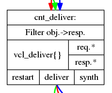

Introducing VCL
===============

.. warning::

   I expect this chapter to change significantly throught its creation, and
   possibly throught the creation of the rest of the book.

   I advise against reviewing the pedagogical aspects of the chapter until
   the text is complete (as in: a summary exists). Or until this warning is
   removed.

   That said, the content itself is correct and you are welcome to read it
   and coment.

The Varnish Configuration Language is a small custom programming language
that gives you the mechanism to hook into Varnish's request handling state
engine at various crucial stages.

Mastering VCL is a matter of learning the language itself, understanding
what the different states mean and how you can utilize the tools that are
you at your disposal.

This chapter focuses on the language itself and a small subset of the
states you can affect. The goal is to give you the skills needed to write
robust VCL that allows Varnish to cache efficiently.

VCL is officially documented in the :title:`vcl` manual page (``man vcl``),
but you would do well if you revisit the state diagrams provided in
appendix A.  Throughout this chapter, those state diagrams will be used as
reference and you will learn how to read them. An other interesting source
of documentation is the actual generator code in VCL, found in
``lib/libvcc/generate.py`` in Varnish 4.1.1 (and other versions), which is
also used to generate the manual files.

What you will not find in this chapter is an extensive description of every
keyword and operator available. That is precisely what the manual page is
for.

Since VCL leans heavily on regular expressions, there is also a small
cheat sheet towards the end, including VCL snippets.

Working with VCL
----------------

VCL is normally stored in ``/etc/varnish/``. Most startup-scripts usually
refer to ``/etc/varnish/default.vcl``, but you are free to call it whatever
you want, as long as your startup scripts refer to them.

To use new VCL, you have two choices:

1. Restart Varnish, losing all cache
2. Reload the VCL without restarting Varnish

During development of entirely new VCL, the first option is usually the
best. Reloading VCL without dropping the cache is a benefit in production,
but when you are testing your VCL, old (potentially "wrong") objects can
add a level of confusion that is best avoided. An example of this is if you
are trying to fix re-write rules. You might end up caching content
incorrectly due to re-write rules, then fix your rules but find the old
content due to the previously wrong VCL.

Reloading VCL is always done through the CLI, but most startup scripts
provide shorthands that does the job for you. You can do it manually using
``varnishadm``::

        # varnishadm vcl.list
        active          0 boot

        # varnishadm vcl.load foo-1 /etc/varnish/default.vcl 
        VCL compiled.
        # varnishadm vcl.list
        active          0 boot
        available       0 foo-1

        # varnishadm vcl.use foo-1
        VCL 'foo-1' now active
        # varnishadm vcl.list
        available       0 boot
        active          0 foo-1

This also demonstrates that Varnish operates with multiple loaded VCLs, but
only one can be active at a time. The VCL needs a run-time name, which can
be anything. The ``boot`` name refers to the VCL varnish booted up with
initially.

Compiling and loading the VCL is done with ``vcl.load <name> <file>``, and
this is where any syntax errors would be detected. After it is loaded, you
need to call ``vcl.use`` to make it the active VCL. You can also switch
back to the previous one with ``vcl.use`` if you like.

A more practical way is to use your startup scripts. E.g::

        # systemctl reload varnish
        # varnishadm vcl.list
        available       0 boot
        available       0 foo-1
        active          0 4ca9d8e9-25d0-4b52-b4b1-247f038061a6

This example from Debian demonstrates that the startup script will pick a
random VCL name, load it and then issue ``vcl.use`` for you.

Over time, VCL files might "pile up" in Varnish, taking up some resources.
This is specially true for backends, where even unused VCL will have active
health checks if health checks are defined in the relevant VCL. You can
explicitly discard old VCL with ``vcl.discard``::

        # varnishadm vcl.list
        available       0 boot
        available       0 foo-1
        active          0 4ca9d8e9-25d0-4b52-b4b1-247f038061a6

        # varnishadm vcl.discard boot

        # varnishadm vcl.list
        available       0 foo-1
        active          0 4ca9d8e9-25d0-4b52-b4b1-247f038061a6

This is not necessary if you restart Varnish instead of reloading.

As of Varnish 4.1.1, Varnish also has a concept of cooldown time, where old
VCL will be set in a "cold" state after a period of time. While "cold",
health checks are not active.

Hello World
-----------

VCL can be split into two parts, the global scope and the request handling.
Both of those can again be further divided.

Backends, access control lists (ACLs), initialization and finalization
functions are all defined in a global scope, but referenced in the request
handling.

The request handling is where you will do most of your VCL-work. With
Varnish 4.0, that is further divided into client requests and backend
requests. In older versions of Varnish, there was no separation between
backend and client requests, but today they represent two somewhat isolated
state machines and are executed in different threads.

The following is a minimal VCL that defines a backend and sets a custom
response header:

.. code:: VCL

        vcl 4.0;

        backend foo {
                .host = "127.0.0.1";
                .port = "8080";
        }

        sub vcl_deliver {
                set resp.http.X-hello = "Hello, world";
        }

The first line is a VCL version string. Right now, there is only one valid
VCL version. Even for Varnish 4.1, the VCL version is 4.0. This is intended
to make transitions to newer versions of Varnish simpler. Every VCL file
starts with `vcl 4.0;` until a significant change in the VCL language is
announced.

Next up, we define a backend server named ``foo``. This is where Varnish
will fetch content. We set the IP of the backend and port. You can have
multiple backends, as long as they have different names. If you only define
a single backend, you don't need to explicitly reference it anywhere, but
if you have multiple backends you need to be explicit about which to use
when. We will deal primarily with simple backends in this chapter.

Last, but not least, we provide some code for the `vcl_deliver` state.  If
you look at the ``cache_req_fsm.svg`` in appendix A, you will find
`vcl_deliver` at the bottom left. It is the last VCL before the request is
delivered back to the client.

The `set resp.http.X-hello = "Hello, world";` line demonstrates how you
can alter variables. `set <variable> = <value>;` is the general syntax
here. Each VCL state has access to different variables. The different
variables are split up in families: `req`, `bereq`, `beresp`, `resp`,
`obj`, `client` and `server`.

In the state diagram (again, see Appendix A), looking closer at the box
where `vcl_deliver` is listed, you will find `resp.*` and `req.*` listed,
suggesting that those families of variables are
available to us in `vcl_deliver`.

In our specific example, `resp.http.X-hello` refers to the artificial
response header ``X-hello`` which we just invented. You can set any
response header you want, but as general rule (and per RFC), prefixing
custom-headers with ``X-`` is the safest choice to avoid conflicts with
other potential intermediaries that are out of your control.

Let's see how it looks::

        # http -p h localhost
        HTTP/1.1 200 OK
        Accept-Ranges: bytes
        Age: 0
        Connection: keep-alive
        Content-Encoding: gzip
        Content-Type: text/html
        Date: Sat, 06 Feb 2016 22:26:04 GMT
        ETag: "2b60-52b20c692a380-gzip"
        Last-Modified: Sat, 06 Feb 2016 21:37:34 GMT
        Server: Apache/2.4.10 (Debian)
        Transfer-Encoding: chunked
        Vary: Accept-Encoding
        Via: 1.1 varnish-v4
        X-Varnish: 2
        X-hello: Hello, world

And there you are, a custom VCL header. You can also use `unset variable;`
to remove headers, and overwrite existing headers.

.. code:: VCL

        vcl 4.0;

        backend foo {
                .host = "127.0.0.1";
                .port = "8080";
        }

        sub vcl_deliver {
                set resp.http.X-hello = "Hello, world";
                unset resp.http.X-Varnish;
                unset resp.http.Via;
                unset resp.http.Age;
                set resp.http.Server = "Generic Webserver 1.0";
        }

The result would be::

        # systemctl restart varnish
        # http -p h localhost:6081
        HTTP/1.1 200 OK
        Accept-Ranges: bytes
        Connection: keep-alive
        Content-Encoding: gzip
        Content-Type: text/html
        Date: Sun, 07 Feb 2016 12:24:36 GMT
        ETag: "2b60-52b20c692a380-gzip"
        Last-Modified: Sat, 06 Feb 2016 21:37:34 GMT
        Server: Generic Webserver 1.0
        Transfer-Encoding: chunked
        Vary: Accept-Encoding
        X-hello: Hello, world

Basic language constructs
-------------------------

Grab a rain coat, you are about to get a bucket full of information thrown
at you. Many of the concepts in the following example will be expanded upon
greatly.

.. code:: VCL
        
        # Comments start with hash
        // Or C++ style //
        /* Or
         * multi-line C-style comments
         * like this.*/
        vcl 4.0;
       
        # White space is largely optional
        backend foo{.host="localhost";.port="80";}

        # vcl_recv is an other VCL state you can modify. It is the first
        # one in the request chain, and we will discuss it in great detail
        # shortly.
        sub vcl_recv {
                # You can use tilde (~) to do regular expression matching
                # text strings, or various other "logical" matchings on
                # things suchs as IP addresses
                if (req.url ~ "^/foo") {
                        set req.http.x-test = "foo";
                } elsif (req.url ~ "^/bar") {
                        set req.http.x-test = "bar";
                }
        }

        # You can define the same VCL function as many times as you want.
        # Varnish will concatenate them together into one big function.
        sub vcl_recv {
                # Use regsub() to do regular expression substitution.
                # regsub() returns a string and takes the format of
                # regsub(<input>,<expression>,<substitution>)
                set req.url = regsub(req.url, "cat","dog");

                # The input of regsub() doesn't have to match where you
                # are storing it, even if it is the most common form.
                set req.http.x-base-url = regsub(req.url, "\?.*$","");

                # Be warned: regsub() only does a single substitution. If
                # you want to substitute all occurences of the pattern, you
                # need to use regsuball() instead. So regsuball() is
                # equivalent to the "/g" option you might have seen in
                # other languages.
                set req.http.X-foo = regsuball(req.url,"foo","bar");
        }

        # You can define your own sub routines, but they can't start with
        # vcl_. Varnish reserves all VCL function names that start with
        # vcl_ for it self.
        sub check_request_method {
                # Custom sub routines can be accessed anywhere, as long as
                # the variables and return methods used are valid where the
                # subroutine is called.
                if (req.method == "POST" || req.method == "PUT") {
                        # The "return" statement is a terminating statement
                        # and serves to exit the VCL processing entirely,
                        # until the next state is reached.
                        #
                        # Different VCL states have different return
                        # statements available to them. A return statement
                        # tells varnish what to do next.
                        #
                        # In this specific example, return (pass); tells
                        # varnish to bypass the cache for this request.
                        return (pass);
                }
        }

        sub vcl_recv {
                # Calling the custom-sub is simple.
                # There are no arguments or return values, because under
                # the hood, "call" just copies the VCL into where the call
                # was made. It is not a true function call.
                call check_request_method;

                # As a consequence, you can not write recursive custom
                # functions.

                # You can use == to check for exact matches. Both for
                # strings and numbers. Varnish either does the right thing
                # or throws a syntax error at you.
                if (req.method == "POST") {
                        # This will never execute. The 'check_request_method'
                        # already checked the request method and if it was
                        # POST, it would have issued "return(pass);"
                        # already, thereby terminating the VCL state and
                        # never reaching this code.
                        set req.http.x-post = "yes";
                }

                # The Host header contains the verbatim Host header, as
                # supplied by the client. Some times, that includes a port
                # number, but typically only if it is user-visible (e.g.:
                # the user entered http://www.example.com:8080/)
                if (req.http.host == "www.example.com" && req.url == "/login") {
                        # return (pass) is an other return statement. It
                        # instructs Varnish to by-pass the cache for this
                        # request.
                        return (pass);
                }
        }

        # Last but not least: You do not have to specify all VCL functions.
        # Varnish provides a built-in which is always appended to your own
        # VCL, and it is designed to be sensible and safe.

.. note::

   All VCL code examples are tested for syntax errors against Varnish
   4.1.1, and are provided in complete form, with the only exception beng
   that smaller examples will leave out the `backend` and `vcl 4.0;` lines
   to preserve brevity.

More on return-statements
-------------------------

A central mechanism of VCL is the return-statement, some times referred to
as a terminating statement. It is important to understand just what this
means.

All states end with a return-statement. If you do not provide one, VCL
execution will "fall through" to the built-in VCL, which always provides a
return-statement.

Similarly, if you provide multiple definitions of `vcl_recv` or some
other function, they will all be glued together as a single block of code.
Any `call foo;` statement will be in-lined (copied into the code). In other
words, the following two examples produce the same C code:

With custom function:

.. code:: VCL

   sub clean_host_header {
           # Strip leading www in host header to avoid caching the same
           # content twice if it is accessed both with and without a
           # leading wwww.
           set req.http.Host = regsub(req.http.Host, "^www\.","");
   }

   sub vcl_recv {
           call clean_host_header;
   }

Without:

.. code:: VCL

   sub vcl_recv {
           set req.http.Host = regsub(req.http.Host, "^www\.","");
   }

Which form you chose is a matter of style. However, it is usually helpful
to split logical bits of code into separate custom functions. This lets you
split cleaning of Host header into a single block of code that doesn't get
mixed with device detection (for example).

But because the custom functions are in-lined, a `return (pass);` issued in
a custom-function would mean that the custom function never returned - that
VCL state was terminated and Varnish would move on to the next phase of
request handling.

Each state has different return methods available. You can see these in the
request flow chart, at the bottom of each box.

Built-in VCL
------------

Varnish works out of the box with no VCL, as long as a back-end is
provided. This is because Varnish provides built-in VCL, sometimes
confusingly referred to as the default VCL for historic reasons.

This VCL can never be removed or overwritten, but it can be bypassed. You
can find it in ``/usr/share/doc/varnish/builtin.vcl`` or similar for your
distribution. It is included in Appendix C for your convenience.

The built-in VCL is designed to make Varnish behave safely on any site. It
is a good habit to let it execute whenever possible. Chapter 1 already
demonstrated how you can influence the cache with no VCL at all, and it
should be a goal to provide as simple VCL as possible.

Each of the built-in VCL functions will be covered individually when we are
dealing with the individual states.

`vcl_recv`
----------

+------------------------------------------------------------+
| `vcl_recv`                                                 |
+=============+==============================================+
| Context     | Client request                               |
+-------------+----------------------------------------------+
| Variables   | `req`, `req_top`, `client`, `server`         |
|             | `local`, `remote`, `storage`, `now`          |
+-------------+----------------------------------------------+
| Return      | `purge`, `hash`, `pass`, `pipe`, `synth`     |
| statements  |                                              |
+-------------+----------------------------------------------+
| Typical use | - Request validation                         |
|             | - Request normalization                      |
|             | - Cookie normalization/cleanup               |
|             | - URL rewrites                               |
|             | - Backend selection                          |
|             | - Purging                                    |
|             | - Request classification (Mobile, IP, etc)   |
|             | - Request-based cache policies               |
+-------------+----------------------------------------------+

The first VCL function that is run after a request is received is called
`vcl_recv`. The only processing Varnish has done at this point is parse the
request into manageable structures.

As the extensive list of typical use cases suggests, it is one of the most
versatile VCL functions available. Almost every Varnish server has a good
chunk of logic and policy in `vcl_recv`.

Let's go through the built-in `vcl_recv` function:

.. code:: VCL

        sub vcl_recv {
            if (req.method == "PRI") {
                /* We do not support SPDY or HTTP/2.0 */
                return (synth(405));
            }
            if (req.method != "GET" &&
              req.method != "HEAD" &&
              req.method != "PUT" &&
              req.method != "POST" &&
              req.method != "TRACE" &&
              req.method != "OPTIONS" &&
              req.method != "DELETE") {
                /* Non-RFC2616 or CONNECT which is weird. */
                return (pipe);
            }

            if (req.method != "GET" && req.method != "HEAD") {
                /* We only deal with GET and HEAD by default */
                return (pass);
            }
            if (req.http.Authorization || req.http.Cookie) {
                /* Not cacheable by default */
                return (pass);
            }
            return (hash);
        }

The built-in VCL is meant to provide a safe, standards-compliant cache that
works with most sites. However, what it is not meant to do is provide a
perfect cache hit rate.

Walking through the list from the top, it starts out by checking if the
request method is ``PRI``, which is a request method for the SPDY protocol,
and/or HTTP/2.0. This is currently unsuported, so Varnish terminates the
VCL state with a ``synth(405)``.

This will cause Varnish to synthesize an error message with a pre-set
status code of 405. If you leave out the status message (e.g "File Not
Found" and "Internal Server Error"), Varnish will pick the standard
response message matching that status code.

You can provide your own error message and even change the status code
later if you decide to add a `vcl_synth` function.

Next, Varnish checks if the request method is one of the valid RFC 2616
request methods (with the exception of ``CONNECT``). If it is not, then
Varnish issues `return (pipe);`, which causes Varnish to enter "pipe mode".

In pipe mode, Varnish connects the client directly to the backend and stops
interpreting the data stream at all. This is best suited for situations
where you need to do something Varnish doesn't support, and should be a
last resort. If you do issue a `pipe` return, then you should probably also
have `set req.http.Connection = "close";`. This will tell your origin
server to close the connection after a single request. If you do not, then
the client will be free to issue other, potentially cacheable, requests
without Varnish being any the wiser.

In short: If in doubt, don't use pipe.

Next, Varnish checks if the request method is ``GET`` or ``HEAD``. If it is
not, then Varnish issues `return (pass);`. This is the best method of
disabling cache based on client input. Unlike in pipe mode, Varnish still
parses the request and and potentially buffers it if you use pass. In fact,
it goes through all the normal VCL states as any other request, allowing
you to do things like retry the request if the backend failed.

At the very end is the biggest challenge with the built-in VCL. If the
request has an ``Authorization`` header, indicating HTTP Basic
Authentication, or if the request has a ``Cookie`` header, the request is
passed (not cached). Since almost all web sites today will have clients
sending cookies, this is one of the most important jobs a VCL author has.

At the end, if none of the other return statements have been issued,
Varnish issues a `return (hash);`. This tells Varnish to create a cache
hash and look it up in the cache. Exactly how that cache hash is
constructed is defined in `vcl_hash`.

To summarize the built in VCL:

- Reject SPDY / HTTP/2.0 requests
- Pipe unknown (possibly unsafe) request methods directly to the backend
- By-pass cache for anything except ``GET`` and ``HEAD`` requests
- By-pass cache for requests with ``Authorization`` or ``Cookie`` headers.

And the return states that are valid are:

- `return (synth());` to generate a response from Varnish. E.g: error
  messages and more.
- `return (pipe);` to connect the client directly to the backend. Avoid if
  possible.
- `return (pass);` to bypass the cache, but otherwise process the request
  as normal.
- `return (hash);` to get ready to check the cache for content.
- `return (purge);` to invalidate matching content in the cache (covered in
  greater detail later).

`vcl_recv` - Massasing a request
--------------------------------

A typical thing to do in `vcl_recv` is to handle URL rewrites, and to
normalize a request. For example, your site might be available on both
``www.example.com`` and ``example.com``. Varnish has no way of knowing that
these host names are the same so without intervention, they would take up
two separate namespaces in your cache: you would cache the content twice.

Similarily, you might offer sports news under both
``http://example.com/sports/`` and ``http://sports.example.com/``. Same
problem.

The best solution to this problem is to do internal rewriting in Varnish,
changing one of them to the other. This is quite easy in VCL.

.. code:: VCL

        sub normalize_sports {
                if (req.http.host == "sports.example.com") {
                        set req.http.host = "example.com";
                        set req.url = "/sports" + req.url;
                }
        }

        sub strip_www {
                set req.http.host = regsub(req.http.host,"^www\.","");
        }

        sub vcl_recv {
                call normalize_sports;
                call strip_www;
        }

Notice how the above VCL split the logically separate problems into two
different sub routines. We could just as easily have placed them both
directly in `vcl_recv`, but the above form will yield a VCL file that is
easier to read and organize over time.

In `normalize_sports` we do an exact string compare between the
client-provided ``Host`` header and ``sports.example.com``. In HTTP, the
name of the header is case insensitive, so it doesn't matter if you type
`req.http.host`, `req.http.Host` or `req.http.HoST`. Varnish will figure it
out.

If the ``Host`` header does match the sports-domain, we change the ``Host``
header to the primary domain name, ``example.com``, and then set the url to
be the same as it was, but with "/sports" prefixed. Note how the example
uses "/sports", not "/sports/". That is because `req.url` always starts
with a ``/``.

The second function, `strip_www`, uses the `regsub()` function to do a
regular expression substitution. The result of that substitution is stored
back onto the Host header.

`regsub()` takes three arguments. The input, the regular expression and
what to change it with. If you are unfamiliar with regular expressions,
there's a brief introduction and cheat sheet later in the chapter.

Note how we do not check if the ``Host`` header contains ``www.`` before we
issue the `regsub()`. That is because the process of checking and the
process of substitution is the same, so there would be no gain.

Testing your work as you go is crucial. You have many alternatives to test
this. I have modified the ``foo.sh`` CGI script to output HTTP headers, so
I can see what the backend sees. Here's an example::

        # http localhost/cgi-bin/foo.sh "Host: example.com"
        HTTP/1.1 200 OK
        Accept-Ranges: bytes
        Age: 0
        Cache-Control: max-age=10
        Connection: keep-alive
        Content-Encoding: gzip
        Content-Type: text/plain
        Date: Tue, 09 Feb 2016 21:19:41 GMT
        Server: Apache/2.4.10 (Debian)
        Transfer-Encoding: chunked
        Vary: Accept-Encoding
        Via: 1.1 varnish-v4
        X-Varnish: 2

        Hello. Random number: 13449
        Tue Feb  9 21:19:41 UTC 2016
        HTTP_ACCEPT='*/*'
        HTTP_ACCEPT_ENCODING=gzip
        HTTP_HOST=example.com
        HTTP_USER_AGENT=HTTPie/0.8.0
        HTTP_X_FORWARDED_FOR=::1
        HTTP_X_VARNISH=3

        # http localhost/cgi-bin/foo.sh "Host: www.example.com"
        HTTP/1.1 200 OK
        Accept-Ranges: bytes
        Age: 3
        Cache-Control: max-age=10
        Connection: keep-alive
        Content-Encoding: gzip
        Content-Length: 175
        Content-Type: text/plain
        Date: Tue, 09 Feb 2016 21:19:41 GMT
        Server: Apache/2.4.10 (Debian)
        Vary: Accept-Encoding
        Via: 1.1 varnish-v4
        X-Varnish: 32770 3

        Hello. Random number: 13449
        Tue Feb  9 21:19:41 UTC 2016
        HTTP_ACCEPT='*/*'
        HTTP_ACCEPT_ENCODING=gzip
        HTTP_HOST=example.com
        HTTP_USER_AGENT=HTTPie/0.8.0
        HTTP_X_FORWARDED_FOR=::1
        HTTP_X_VARNISH=3

        # http localhost/cgi-bin/foo.sh "Host: example.com"
        HTTP/1.1 200 OK
        Accept-Ranges: bytes
        Age: 6
        Cache-Control: max-age=10
        Connection: keep-alive
        Content-Encoding: gzip
        Content-Length: 175
        Content-Type: text/plain
        Date: Tue, 09 Feb 2016 21:19:41 GMT
        Server: Apache/2.4.10 (Debian)
        Vary: Accept-Encoding
        Via: 1.1 varnish-v4
        X-Varnish: 32772 3

        Hello. Random number: 13449
        Tue Feb  9 21:19:41 UTC 2016
        HTTP_ACCEPT='*/*'
        HTTP_ACCEPT_ENCODING=gzip
        HTTP_HOST=example.com
        HTTP_USER_AGENT=HTTPie/0.8.0
        HTTP_X_FORWARDED_FOR=::1
        HTTP_X_VARNISH=3

The test issues three requests. The first is a cache miss for
``www.example.com``, the second is a cache hit for `example.com`. Looking
at the content, we can easily see that it's the same. Our rewrite
apparently worked!

The third request is again for ``www.example.com`` and is also a cache hit.
This is included so you can look closer at what happens to the
``X-Varnish`` header.

In the cache miss, it had a value of "2", however, the backend reports that
``HTTP_X_VARNISH=3``. The second request gets a ``X-Varnish`` response of 
``X-Varnish: 32770 3``. The first number is the ``xid`` of the request
being processed, while the second is the ``xid`` of the backend request
that generated the content. You can verify that the two last requests gives
the same content by looking at that header instead of the content.

We can also see this in ``varnishlog``. Since we already covered
``varnishlog`` in detail, we aren't going to repeat that, except as it
pertains to VCL. This is from the above requests::

        *   << Request  >> 32770     
        -   Begin          req 32769 rxreq
        -   Timestamp      Start: 1455052784.964533 0.000000 0.000000
        -   Timestamp      Req: 1455052784.964533 0.000000 0.000000
        -   ReqStart       ::1 46964
        -   ReqMethod      GET
        -   ReqURL         /cgi-bin/foo.sh
        -   ReqProtocol    HTTP/1.1
        -   ReqHeader      Connection: keep-alive
        -   ReqHeader      Host:  www.example.com
        -   ReqHeader      Accept-Encoding: gzip, deflate
        -   ReqHeader      Accept: */*
        -   ReqHeader      User-Agent: HTTPie/0.8.0
        -   ReqHeader      X-Forwarded-For: ::1
        -   VCL_call       RECV
        -   ReqUnset       Host:  www.example.com
        -   ReqHeader      host: example.com
        -   VCL_return     hash
        -   ReqUnset       Accept-Encoding: gzip, deflate
        -   ReqHeader      Accept-Encoding: gzip
        -   VCL_call       HASH
        -   VCL_return     lookup
        -   Hit            2147483651
        -   VCL_call       HIT
        -   VCL_return     deliver
        -   RespProtocol   HTTP/1.1
        -   RespStatus     200
        -   RespReason     OK
        -   RespHeader     Date: Tue, 09 Feb 2016 21:19:41 GMT
        -   RespHeader     Server: Apache/2.4.10 (Debian)
        -   RespHeader     Cache-Control: max-age=10
        -   RespHeader     Vary: Accept-Encoding
        -   RespHeader     Content-Encoding: gzip
        -   RespHeader     Content-Type: text/plain
        -   RespHeader     X-Varnish: 32770 3
        -   RespHeader     Age: 3
        -   RespHeader     Via: 1.1 varnish-v4
        -   VCL_call       DELIVER
        -   VCL_return     deliver
        -   Timestamp      Process: 1455052784.964572 0.000039 0.000039
        -   RespHeader     Content-Length: 175
        -   Debug          "RES_MODE 2"
        -   RespHeader     Connection: keep-alive
        -   RespHeader     Accept-Ranges: bytes
        -   Timestamp      Resp: 1455052784.964609 0.000076 0.000037
        -   Debug          "XXX REF 2"
        -   ReqAcct        151 0 151 304 175 479
        -   End            

What you want to take special notice of is this bit::

        -   VCL_call       RECV
        -   ReqUnset       Host:  www.example.com
        -   ReqHeader      host: example.com
        -   VCL_return     hash

This tells you that the RECV functions in VCL was called, or `vcl_recv` if
you'd like, then it tells you that the Host header was first `unset`, then
`set` again with a changed value, and last, it reveals the return statement
from `vcl_recv`: hash.

Testing the other rewrite is also pretty easy::

        # http localhost/cgi-bin/foo.sh "Host: sports.example.com" 
        HTTP/1.1 404 Not Found
        Age: 0
        Connection: keep-alive
        Content-Length: 298
        Content-Type: text/html; charset=iso-8859-1
        Date: Tue, 09 Feb 2016 21:32:03 GMT
        Server: Apache/2.4.10 (Debian)
        Via: 1.1 varnish-v4
        X-Varnish: 2

        <!DOCTYPE HTML PUBLIC "-//IETF//DTD HTML 2.0//EN">
        <html><head>
        <title>404 Not Found</title>
        </head><body>
        <h1>Not Found</h1>
        
The requested URL /sports/cgi-bin/foo.sh was not found on this server.

        

        <address>Apache/2.4.10 (Debian) Server at example.com Port 8080</address>
        </body></html>

        # varnishlog -d -g session -q 'ReqHeader:Host ~ "sports.example.com"'
        *   << Session  >> 1         
        -   Begin          sess 0 HTTP/1
        -   SessOpen       ::1 46980 :80 ::1 80 1455053523.467424 12
        -   Link           req 2 rxreq
        -   SessClose      REM_CLOSE 0.008
        -   End            
        **  << Request  >> 2         
        --  Begin          req 1 rxreq
        --  Timestamp      Start: 1455053523.467464 0.000000 0.000000
        --  Timestamp      Req: 1455053523.467464 0.000000 0.000000
        --  ReqStart       ::1 46980
        --  ReqMethod      GET
        --  ReqURL         /cgi-bin/foo.sh
        --  ReqProtocol    HTTP/1.1
        --  ReqHeader      Connection: keep-alive
        --  ReqHeader      Host:  sports.example.com
        --  ReqHeader      Accept-Encoding: gzip, deflate
        --  ReqHeader      Accept: */*
        --  ReqHeader      User-Agent: HTTPie/0.8.0
        --  ReqHeader      X-Forwarded-For: ::1
        --  VCL_call       RECV
        --  ReqUnset       Host:  sports.example.com
        --  ReqHeader      host: example.com
        --  ReqURL         /sports/cgi-bin/foo.sh
        --  ReqUnset       host: example.com
        --  ReqHeader      host: example.com
        --  VCL_return     hash
        --  ReqUnset       Accept-Encoding: gzip, deflate
        --  ReqHeader      Accept-Encoding: gzip
        --  VCL_call       HASH
        --  VCL_return     lookup
        --  Debug          "XXXX MISS"
        --  VCL_call       MISS
        --  VCL_return     fetch
        --  Link           bereq 3 fetch
        --  Timestamp      Fetch: 1455053523.467898 0.000435 0.000435
        --  RespProtocol   HTTP/1.1
        --  RespStatus     404
        --  RespReason     Not Found
        --  RespHeader     Date: Tue, 09 Feb 2016 21:32:03 GMT
        --  RespHeader     Server: Apache/2.4.10 (Debian)
        --  RespHeader     Content-Type: text/html; charset=iso-8859-1
        --  RespHeader     X-Varnish: 2
        --  RespHeader     Age: 0
        --  RespHeader     Via: 1.1 varnish-v4
        --  VCL_call       DELIVER
        --  VCL_return     deliver
        --  Timestamp      Process: 1455053523.467942 0.000478 0.000043
        --  RespHeader     Content-Length: 298
        --  Debug          "RES_MODE 2"
        --  RespHeader     Connection: keep-alive
        --  Timestamp      Resp: 1455053523.467967 0.000503 0.000025
        --  Debug          "XXX REF 2"
        --  ReqAcct        154 0 154 228 298 526
        --  End            
        *** << BeReq    >> 3         
        --- Begin          bereq 2 fetch
        --- Timestamp      Start: 1455053523.467534 0.000000 0.000000
        --- BereqMethod    GET
        --- BereqURL       /sports/cgi-bin/foo.sh
        --- BereqProtocol  HTTP/1.1
        --- BereqHeader    Accept: */*
        --- BereqHeader    User-Agent: HTTPie/0.8.0
        --- BereqHeader    X-Forwarded-For: ::1
        --- BereqHeader    host: example.com
        --- BereqHeader    Accept-Encoding: gzip
        --- BereqHeader    X-Varnish: 3
        --- VCL_call       BACKEND_FETCH
        --- VCL_return     fetch
        --- BackendOpen    17 default(127.0.0.1,,8080) 127.0.0.1 46558 
        --- Backend        17 default default(127.0.0.1,,8080)
        --- Timestamp      Bereq: 1455053523.467666 0.000133 0.000133
        --- Timestamp      Beresp: 1455053523.467808 0.000274 0.000142
        --- BerespProtocol HTTP/1.1
        --- BerespStatus   404
        --- BerespReason   Not Found
        --- BerespHeader   Date: Tue, 09 Feb 2016 21:32:03 GMT
        --- BerespHeader   Server: Apache/2.4.10 (Debian)
        --- BerespHeader   Content-Length: 298
        --- BerespHeader   Content-Type: text/html; charset=iso-8859-1
        --- TTL            RFC 120 -1 -1 1455053523 1455053523 1455053523 0 0
        --- VCL_call       BACKEND_RESPONSE
        --- VCL_return     deliver
        --- Storage        malloc s0
        --- ObjProtocol    HTTP/1.1
        --- ObjStatus      404
        --- ObjReason      Not Found
        --- ObjHeader      Date: Tue, 09 Feb 2016 21:32:03 GMT
        --- ObjHeader      Server: Apache/2.4.10 (Debian)
        --- ObjHeader      Content-Type: text/html; charset=iso-8859-1
        --- Fetch_Body     3 length stream
        --- BackendReuse   17 default(127.0.0.1,,8080)
        --- Timestamp      BerespBody: 1455053523.467896 0.000362 0.000087
        --- Length         298
        --- BereqAcct      156 0 156 161 298 459
        --- End      

The backend sort of confirmed it for us due to the 404 message outputting
the rewritten URL, but it is a good idea to get used to ``varnishlog``.

Future examples will not include quite as verbose testing transcripts,
though.

`vcl_hash`
----------

+------------------------------------------------------------+
| `vcl_hash`                                                 |
+=============+==============================================+
| Context     | Client request                               |
+-------------+----------------------------------------------+
| Variables   | `req`, `req_top`, `client`, `server`         |
|             | `local`, `remote`, `storage`, `now`          |
+-------------+----------------------------------------------+
| Return      | `lookup`                                     |
| statements  |                                              |
+-------------+----------------------------------------------+
| Typical use | - Adjusting the cache hash.                  |
|             | - Adding the Cookie to the hash              |
+-------------+----------------------------------------------+

If you return `hash` or `purge` in `vcl_recv`, Varnish will immediately
execute the `vcl_hash` function. It has a very simple purpose: Defining
what identifies a unique object in the cache. You add items to cache hash,
and as long as two requests add up to the same hash, they are treated as
the same object.

The built in VCL shows us what it's all about:

.. code:: VCL

        sub vcl_hash {
            hash_data(req.url);
            if (req.http.host) {
                hash_data(req.http.host);
            } else {
                hash_data(server.ip);
            }
            return (lookup);
        }

The `hash_data()` keyword is used to add items to hash. The built-in VCL is
simple enough. It adds the URL and either the server IP or the Host header.

In other words: If the URL and the ``Host``-header is the same, the object
is the same.

It is rare that you need to add extra logic to `vcl_hash`. The most common
use case is when you want to cache content generated based on cookies.

The only valid return statement in `vcl_hash` is `return (lookup);`,
telling Varnish that it's time to look the hash up in cache to see if it's
a cache hit or not.

`vcl_pipe`
----------

+------------------------------------------------------------+
| `vcl_pipe`                                                 |
+=============+==============================================+
| Context     | Client request                               |
+-------------+----------------------------------------------+
| Variables   | `req`, `bereq`, `req_top`, `client`, `server`|
|             | `server`, `local`, `remote`, `storage`, `now`|
+-------------+----------------------------------------------+
| Return      | `pipe`, `synth`                              |
| statements  |                                              |
+-------------+----------------------------------------------+
| Typical use |                                              |
+-------------+----------------------------------------------+

In *pipe mode*, Varnish opens a connection to the backend and starts moving
data between the client and backend without any interference. It is used as
a last resort if what you need to do isn't supported by Varnish. Once in
pipe mode, the client can send unfiltered data to the server and get
replies without Varnish interpreting them - for better or worse.

In HTTP 1.1, *keep-alive* is the default connection mode. This means a
client can send multiple requests serialized over the same TCP connection.
For pipe mode, Varnish suggests that the server should disable this by
adding ``Connection: close`` before entering `vcl_pipe`. If it didn't, then
subsequent requests after the piped requests would also bypass the cache
completely.

You can override this in `vcl_pipe` if you really want to, but there isn't
any good reason to do so that the author is aware of. The built-in VCL for
`vcl_pipe` is empty, save for a comment:

.. code:: VCL

        sub vcl_pipe {
            # By default Connection: close is set on all piped requests, to stop
            # connection reuse from sending future requests directly to the
            # (potentially) wrong backend. If you do want this to happen, you can undo
            # it here.
            # unset bereq.http.connection;
            return (pipe);
        }

`vcl_deliver`
-------------

+------------------------------------------------------------+
| `vcl_deliver`                                              |
+=============+==============================================+
| Context     | Client request                               |
+-------------+----------------------------------------------+
| Variables   | `req`, `req_top`, `client`, `server`         |
|             | `local`, `remote`, `storage`, `now`,         |
|             | `obj.hits`, `obj.uncacheable`, `resp`        |
+-------------+----------------------------------------------+
| Return      | `deliver`, `synth`, `restart`                |
| statements  |                                              |
+-------------+----------------------------------------------+
| Typical use | - Adding or removing response headers        |
|             | - Restarting the request in case of errors   |
+-------------+----------------------------------------------+

You saw in the :title:`Hello world` VCL what `vcl_deliver` is all about. It
is the very last VCL state to execute before Varnish starts sending data to
the client. The built-in VCL for `vcl_deliver` is completely empty.

.. code:: VCL

        sub vcl_deliver {
            return (deliver);
        }

A very popular thing to do in `vcl_deliver` is to add a response header
indicating if the request was a cache hit or a cache miss. This can be done
by evaluating the `obj.hits` variable, which is a reference to the cached
object (if any), and how any times it has been hit. If this was a cache
hit, the value will be 1 or greater.

.. code:: VCL

   sub vcl_deliver {
           if (obj.hits > 0) {
                   set resp.http.X-Cache-Hit = "true";
                   set resp.http.X-Cache-Hits = obj.hits;
           } else {
                   set resp.http.X-Cache-Hit = "true";
           }
   }

Other than `obj.hits` and `obj.uncacheable`, you do not have direct access
to the object. You do, however, have most of what you need in `resp.*`. The
cached object is always read-only, but the `resp` data structure represents
a this specific response, not the cached object it self. As such, you can
modify it.

The `obj.uncacheable` variable can be used to identify if the response was
cacheable at all. If you issued `return (hash);` in `vcl_recv`, and the
backend and relevant VCL didn't prevent it, the value will be true.

